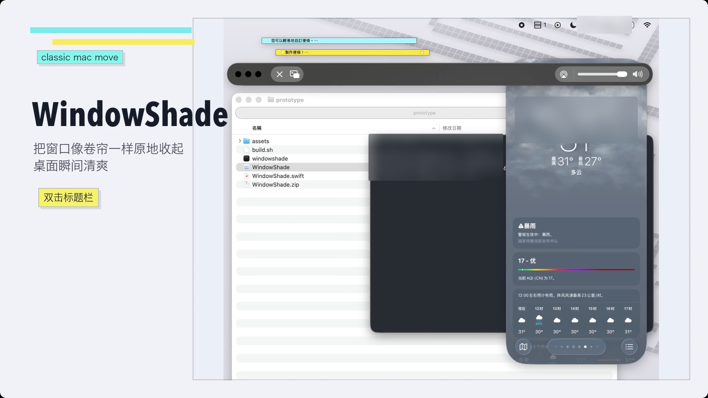

<p align="center">
  
</p>

<p align="center">
  <strong>WindowShade</strong><br>
  Roll a macOS window up without sending it away.
</p>

<p align="center">
  <a href="README.md">English</a> · <a href="README_CN.md">简体中文</a>
</p>

<p align="center">
  
</p>

---

WindowShade is a small macOS prototype that brings back a classic Mac gesture: fold a window into a thin strip, then unfold it from the same spot.

Press `Control + Command + C`, or double-click a title bar. The window gets out of the way without disappearing into the Dock.

## Current state

This is a prototype, not a polished release.

It can:

- live in the menu bar, without a Dock icon;
- fold and unfold the current window;
- restore folded windows from the menu bar menu;
- show either captured window chrome or a standard proxy title bar;
- offer basic preview, arranging, sound, and permission settings.

Some apps still need special handling. Full-screen spaces, custom title bars, Stage Manager, and multi-display setups can break the spell.

## Permissions

WindowShade asks for two macOS permissions:

- Accessibility, so it can find and move windows.
- Screen Recording, so it can capture the top of a window for the folded strip.

It does not upload window contents. Local diagnostics go to `/tmp/windowshade.log`; those logs can include app names, window titles, and file paths.

## Build

You need macOS 14 or newer and the Xcode command line tools.

```sh
cd prototype
./build.sh
open WindowShade.app
```

The build script creates `WindowShade.app` and signs it ad-hoc by default. To keep macOS permission trust across rebuilds, sign with your own certificate:

```sh
cd prototype
CODESIGN_IDENTITY="Apple Development: Your Name (TEAMID)" ./build.sh
```

## Notes

The main code is in [`prototype/WindowShade.swift`](prototype/WindowShade.swift).

For the history and design thinking behind the prototype, see [`WindowShade.md`](WindowShade.md).
