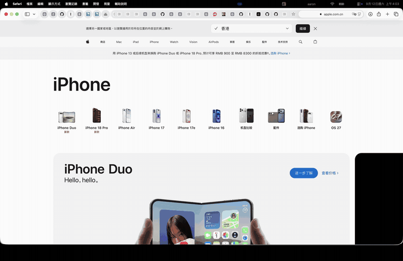
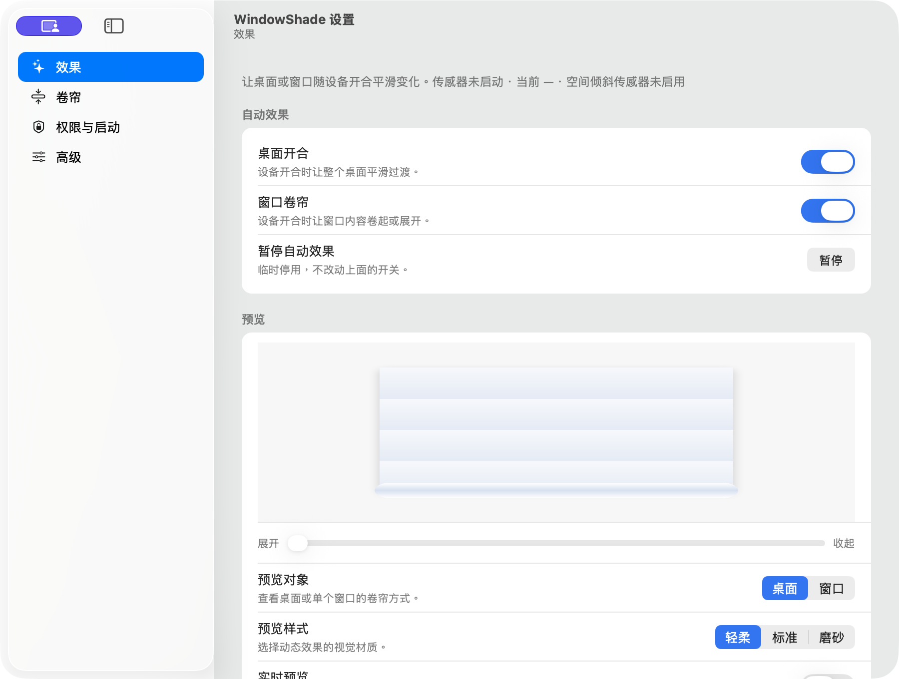

<h1 align="center">
  <br>
  WindowShade
</h1>

<p align="center">
  <strong>Keep windows in place while clearing the view.</strong><br>
  A small macOS menu bar app that brings back the classic window shade gesture.
</p>

<p align="center">
  <a href="https://github.com/surfine/WindowShade/releases/latest"></a>
  
  <a href="README_CN.md"></a>
</p>

---





WindowShade is for the small desktop moment when a window is in the way, but it still belongs exactly where you put it.

It folds the window content into a slim, identifiable strip that can be dragged, previewed, and opened again. The window stays with its app and keeps its place in your layout.

## Three capabilities

| Capability | What it does | Good for |
| --- | --- | --- |
| **Fold windows** | Roll content away and leave a title-bar entry in place. | Clear the desktop without losing a document's place. |
| **Pinned previews** | Keep a window visible as a live floating preview. | Reference windows, mirroring, dashboards, and things you want to watch. |
| **Dynamic effects** | Apply a smooth fold effect to the desktop or a window as the device opens and closes. | Let window state follow the device's hinge movement. |

## Menu bar and settings

The menu bar manages the current window and window lists; the hinge angle is read-only status. Dynamic-effect switches, styles, trigger angle, live preview, and permissions live under Settings → Effects. The optional experimental device-tilt switch uses the Apple Silicon sensor hub for a subtle parallax motion; it only affects the desktop effect while it is running.

## Basic use

| Action | Shortcut / gesture |
| --- | --- |
| Fold or unfold the current window | Control + Command + C |
| Fold or unfold a specific window | Double-click its title bar |
| Preview a folded window | Click its folded strip |
| Pin or unpin the current window | Control + Command + P |
| Unfold by menu order | Control + Command + 1…9 |
| Arrange strips / Focus Shelf (Experimental) | Control + Command + 0 |
| Configure dynamic effects | Menu bar → Settings → Effects |

## Permissions and privacy

WindowShade uses two macOS permissions as needed, plus one experimental local sensor read:

- **Accessibility** — to find, move, focus, and restore windows.
- **Screen Recording** — to capture title bars, window previews, and live effect previews.
- **Apple Silicon accelerometer** — not a system permission. With “Tilt with device” enabled, the effect reads a local HID report; some models or security contexts report it as unavailable.

Live preview is off by default and only checks Screen Recording access when you turn it on. Window contents never leave your Mac.

## Compatibility

Most ordinary desktop windows work directly. Apps with custom title bars receive app-specific handling. Full-screen, Split View, Stage Manager, multi-display, and sandboxed apps may need additional handling.

Dynamic effects need a Mac whose hinge reports an angle (Apple Silicon MacBooks); device tilt additionally needs the system to expose the AppleSPU accelerometer.

## Download

Download the latest zip from [Releases](https://github.com/surfine/WindowShade/releases/latest), unzip it, and open WindowShade.app. WindowShade lives in the menu bar and does not show a Dock icon.

Per-version changes live in the [release notes](https://github.com/surfine/WindowShade/releases). The signing identity is unchanged, so installing over an older copy keeps your Accessibility and Screen Recording grants.

## Build from source

Requirements: macOS 14+, Xcode command line tools, and an Apple Development certificate for signing.

```sh
git clone https://github.com/surfine/WindowShade.git
cd WindowShade/prototype
./build.sh
open WindowShade.app
```

To only verify compilation:

```sh
./build.sh --check
```

Set the signing identity through WINDOWSHADE_CODESIGN_IDENTITY or a local untracked prototype/local-codesign.env. See DEVELOPMENT.md for build and release details.

## Project layout

Everything lives under `prototype/`, split by responsibility: `App/` for menus, settings, and the fold entry points, `Capture/` for screenshots and caching, `Effects/` for the animated effects and rendering, `Recovery/` for the restore journal and window rescue, plus `Overlay/`, `Window/`, `Compatibility/`, and `Private/` for the isolated private-API calls.

Module layout, build, and release steps are in DEVELOPMENT.md; design background is in WindowShade.md.

## Third-party

WindowShade is [MIT licensed](LICENSE). The effects, sensor, and recovery paths are all original implementations in this repository.
