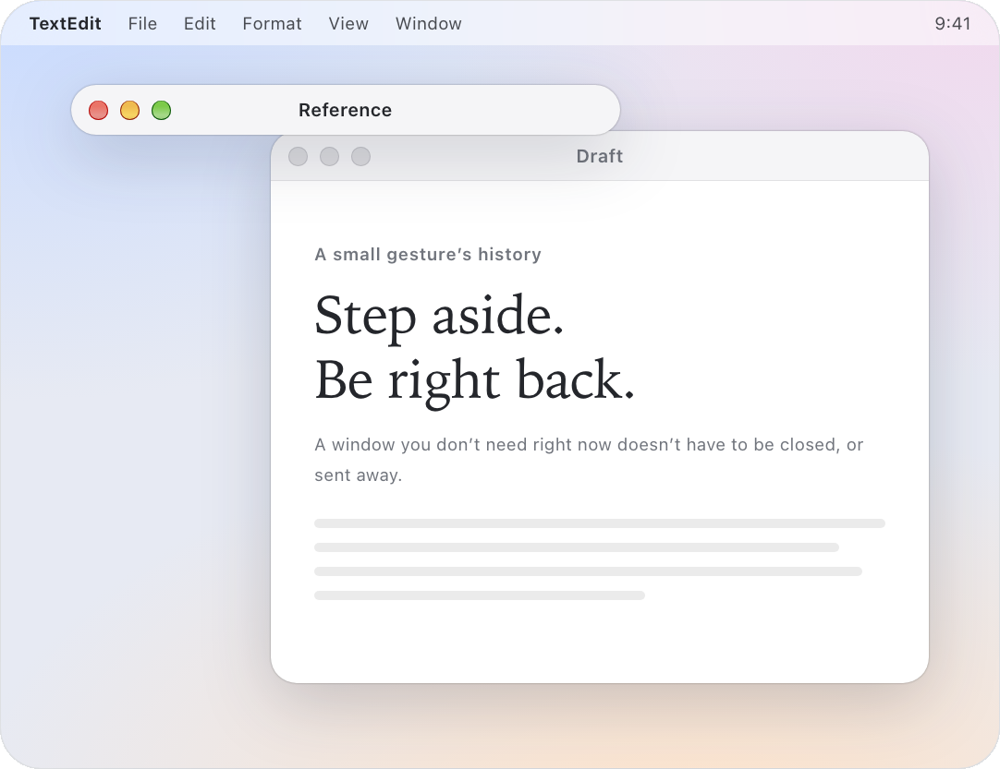
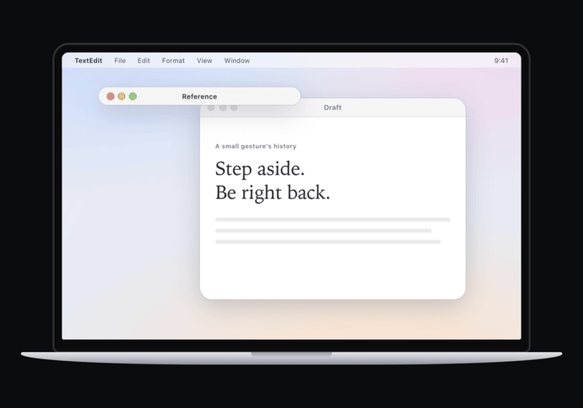

<div align="center">


# WindowShade

**Roll it up. Keep its place.**<br>
Double-click a title bar and the window rolls up into a thin bar, right where it was.<br>
Double-click again and it’s back. Rest the pointer on the bar to glance at it without unrolling.<br>
A free, open-source window utility for Mac.

[](https://github.com/surfine/WindowShade/releases/latest)
[](#download)
[](#download)
[](LICENSE)

[**Download for Mac**](https://github.com/surfine/WindowShade/releases/latest) · [**Website**](https://windowshade.pages.dev/en/) · [**Window stories**](https://windowshade.pages.dev/en/history/) · [简体中文](README_CN.md)

<picture>
  <source media="(prefers-color-scheme: dark)" srcset="assets/readme-desk-en-dark.png">
  
</picture>

<sub>The interactive illustration from the website: Reference rolls up, and the draft behind it shows through. <a href="https://windowshade.pages.dev/en/">Try it yourself →</a></sub>

</div>

## Three ways to move a window aside. Only one never makes you look for it.

When a window covers something, you probably close it or minimize it. Both work. Getting it back just takes a little effort.

| | Where the window goes | Getting it back |
| --- | --- | --- |
| **Close** | It’s gone | Open it again, then find your place again |
| **Minimize** | Into the Dock | Spot it in the Dock first |
| **Roll up** | A thin bar, right where it was | Double-click the bar |

Unlike minimizing, the window never leaves the desktop. Drag the bar somewhere else and the window opens there.

## This double-click is older than your Mac

In the ’90s, most Mac users knew this trick. Then the system changed course, sent windows to the Dock, and the trick was slowly forgotten. We wrote its story as a long read you can operate, **[Window stories](https://windowshade.pages.dev/en/history/)**: seven chapters, four hands-on experiments, 14 primary sources.

1. [Don’t close it yet](https://windowshade.pages.dev/en/history/#space): one desktop, three arrangements, side by side
2. [A small utility](https://windowshade.pages.dev/en/history/#origin): a 1994 user-group newsletter
3. [Two clicks or three](https://windowshade.pages.dev/en/history/#preference): change the old control panel yourself
4. [A button for it](https://windowshade.pages.dev/en/history/#button): drag a rolled-up window somewhere new
5. [Off to the Dock](https://windowshade.pages.dev/en/history/#departure): the Dock, Exposé and Mission Control
6. [Still in use](https://windowshade.pages.dev/en/history/#survival): Stickies still keeps the trick
7. [Back to today](https://windowshade.pages.dev/en/history/#return): an old gesture on today’s desk

Then [boot an old Mac](https://windowshade.pages.dev/en/history/#lab) — System 7.5, Mac OS 8 or Mac OS X 10.1, run by [Infinite Mac](https://infinitemac.org/) — and find the setting through the original menus yourself.

Today’s WindowShade is an independent Swift / AppKit app: the old name and the old idea, with code written from scratch. It is not an Apple product, and it uses no code from Rob Johnston, Apple, or Unsanity’s WindowShade X.

## Beyond the old gesture, it keeps track of every window

Roll up, and a window stays where it was. Glance, and you see it without unrolling. Carry it to every desktop, and you can see it from anywhere. Pin, and it stays in front. Browse, and you find it from the Dock. They all answer one question: where is the window you need, without a round trip to get it?

**Roll up.** Double-click a title bar or press `⌃⌘C` and the window rolls up into a thin bar; double-click the bar to unroll it. The bar can keep the window’s own look, or use one consistent title bar.

**Swipe the title bar.** With the pointer on a title bar, push two fingers up and the window rolls up like a shade; pull down and it fills the screen between the menu bar and the Dock, and pushing up again puts it back. Pull down on a rolled-up bar to unroll it. Swipe left or right for half the screen; spreading two fingers, as if zooming into a photo, also fills the screen, and pinching puts it back. Double-tap (two fingers on a trackpad, one on a Magic Mouse) to toggle between filled and the previous size. Three notches of an ordinary scroll wheel count as one swipe. Magic Mouse support is included but still awaits testing on real hardware. While you move, a small panel styled like the system volume indicator appears by the window, showing what letting go will do and how far is left; pull back to cancel. Swiping sideways on a Safari tab still switches tabs, and if Swish is running, title-bar gestures are left to it. Details are in the [gesture notes](docs/gestures.md).

**Glance.** Rest the pointer on the bar and a card drops down beneath it, showing the window's content at its own size; move away and it rolls back up. Click the card to unroll the window for real. The bar stays put and the card hangs just below it, so it reads as a preview, not the window itself. A glance never switches the app you’re in and never moves a window. A window that was minimized when it rolled up can’t be shown live, so you see how it looked then, and the corner says so. Details are in the [glance notes](docs/glance.md).

**Carry to every desktop.** If you keep one app per desktop, press `⌃⌘G` to carry the current window to every desktop: it stays where it is, and its bar appears in the top-right corner of your other desktops. Rest on the bar for a live picture; if the window is hidden or minimized, a labelled snapshot appears instead. Click the picture to go to it. Press `⌃⌘G` again, or click the bar’s ×, to put it down.

**Pin.** Writing from notes, or following a tutorial step by step? Press `⌃⌘P` to pin that window, and it stays uncovered while you switch to anything else. The menu bar lists every pinned window and can unpin them all at once.

**Window browsing.** Rest the pointer on an app’s icon in the Dock and every window that app has open is listed, each with a picture and a title.

- The panel is for looking. A window changes only when you press a button on its card.
- Select a window and press Space for a large preview. The window isn’t brought forward or moved.
- Left half, right half, a corner, centred, full, or another display: it shows where the window will go and moves it only when you agree. You can undo afterwards.

You can also open it from Choose window… in the menu bar, or with a hot key you set. The Dock entry is off by default; turn it on in Settings → Window browsing. The panel is temporary: it does not replace the Dock or take over Command-Tab. Details are in the [window browsing notes](docs/window-browser.md).

**An extra: close the lid, and the desktop stays put.**



On an Apple Silicon MacBook with a hinge sensor, the screen closes but the desktop seems to stay where it was, like a page behind glass, growing darker and blurrier toward the top. Open the lid and it’s back. There are three styles: gentle, standard and frosted. It’s only an extra: rolling up and pinning work without it.

## Five shortcuts. That’s all.

| Shortcut | What it does |
| --- | --- |
| `⌃⌘C` | Roll up or unroll the current window |
| `⌃⌘P` | Pin or unpin the current window |
| `⌃⌘G` | Carry the current window to every desktop; press again to put it down |
| `⌃⌘1…9` | Unroll a rolled-up window, in menu order |
| `⌃⌘0` | Line up the bars, or switch to a focus layout |

Double-click a title bar to roll up; double-click the bar to unroll. Every shortcut can be changed or turned off in Settings, and if another app already uses a combination, WindowShade tells you once.

## Download

Get the latest ZIP from [Releases](https://github.com/surfine/WindowShade/releases/latest), unzip it, drag `WindowShade.app` into Applications and open it, then follow the permission prompts. It lives in the menu bar and stays out of your Dock.

- **1.0.15 download:** 3.99 MB ZIP; the extracted app contains 7.72 MB of files (decimal MB; filesystem allocation may differ).
- **Needs macOS 14 or later and Apple Silicon.** There’s no Intel build.
- **Not notarized yet.** If macOS blocks the first launch, go to System Settings → Privacy & Security and choose Open Anyway. You don’t need to turn off any system security.
- Every release comes with a SHA-256 checksum. For what changed in each version, see the [release notes](https://github.com/surfine/WindowShade/releases).

## Your windows stay on your Mac

WindowShade asks for two permissions. **Accessibility**: finding, moving and restoring windows. **Screen Recording**: taking the window pictures used for previews. “Screen Recording” is just the name the system gives that permission — everything is processed on your Mac and nothing is uploaded. If the app ever quits unexpectedly, your windows go back to how they were.

Regular windows all roll up. Stickies rolls up in its own system way; apps like Adobe’s that draw their own title bars are handled separately. Full screen, Split View, Stage Manager and multiple displays still have a few gaps — try it once with the apps you use. If something goes wrong, please [report it](https://github.com/surfine/WindowShade/issues) with your macOS version, the app, and the steps.

## Build and contribute

Requires macOS 14+, Xcode command line tools with the Metal compiler, and an Apple Development signing certificate.

```sh
git clone https://github.com/surfine/WindowShade.git
cd WindowShade/prototype
./build.sh --check   # Swift type checking and Metal compilation
./build.sh           # build and sign with your configured identity
open WindowShade.app
```

Set `WINDOWSHADE_CODESIGN_IDENTITY` or use an untracked `prototype/local-codesign.env`. See [DEVELOPMENT.md](DEVELOPMENT.md) for signing, isolated builds, and release instructions; interface and website copy follows the [copy guide](docs/copy-guide.md).

| In the repository | Purpose |
| --- | --- |
| [`prototype/`](prototype/) | Native app: window policies, capture, overlays, effects, and recovery |
| [`tests/`](tests/) | State, recovery, frame, Metal, and paper-component checks |
| [`site/`](site/) | Bilingual website and window stories, hosted on Cloudflare Pages |
| [`docs/performance.md`](docs/performance.md) | Measurements and approaches that did or did not work |
| [`docs/releases/`](docs/releases/) | Preserved release notes |
| [`WindowShade.md`](WindowShade.md) | Original design rationale and research notes |

For changes to window behavior, include the affected app and window type, what happened before and after, and the checks you ran.

## Credits and license

[MIT](LICENSE) for this project's code. Historical names and software belong to their respective authors. The window stories credit [Infinite Mac](https://infinitemac.org/), Marcin Wichary's [Frame of preference](https://aresluna.org/frame-of-preference/), and [AI System 6](https://github.com/surfine/AI-System-6) for its era-rendering reference. Bundled font and reference-asset licenses are retained in [`site/public/fonts/`](site/public/fonts/).
