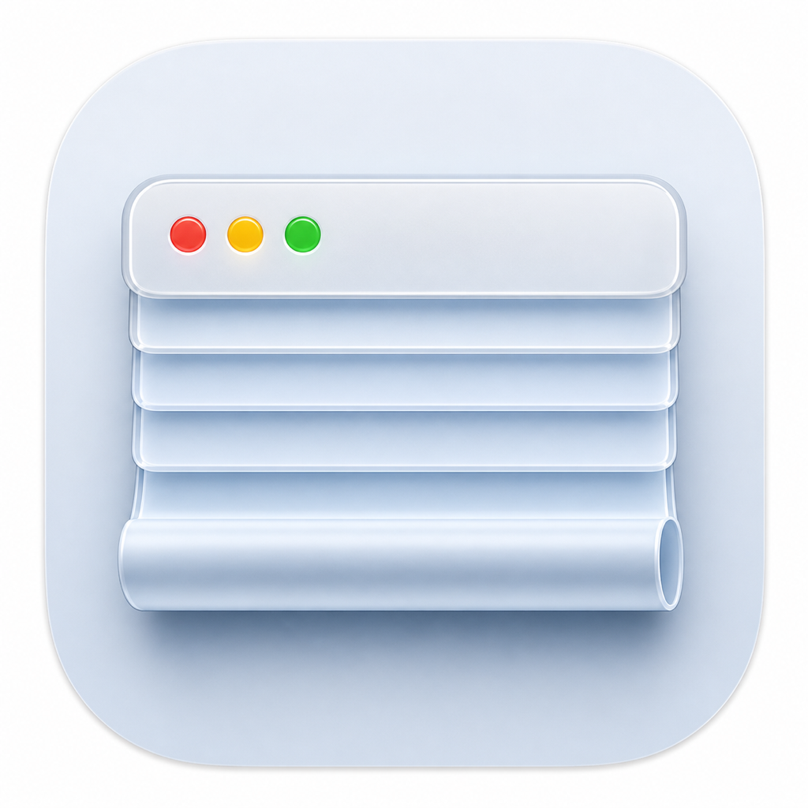
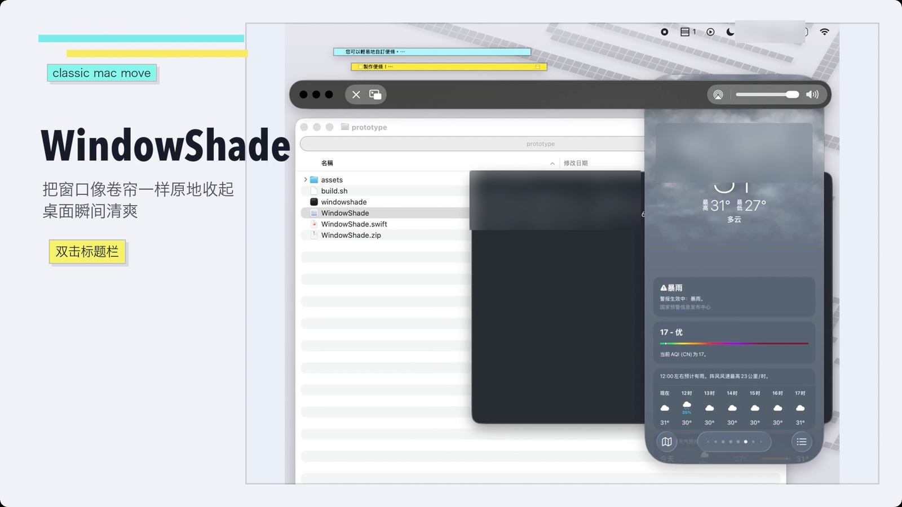
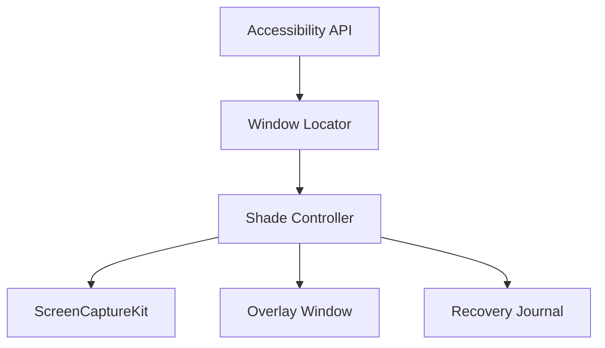

<h1 align="center">
  <br>
  WindowShade
</h1>

<p align="center">
  <strong>Fold windows out of the way without losing their place.</strong><br>
  A small macOS menu bar app that brings back the classic window shade gesture for modern desktops.
</p>

<p align="center">
  <a href="https://github.com/surfine/WindowShade/releases/latest"></a>
  <a href="https://github.com/surfine/WindowShade/stargazers"></a>
  
  <a href="README_CN.md"></a>
</p>

<p align="center">
  <a href="https://www.bilibili.com/video/BV1m5Kf6bE6k/" title="Watch the demo video">
    
  </a>
  <br>
  <a href="https://www.bilibili.com/video/BV1m5Kf6bE6k/">Watch the demo video</a>
</p>

---

WindowShade is for the little desktop moment that macOS still makes oddly expensive: a window is in the way, but it still belongs exactly where you put it.

It folds the window content into a slim title-bar strip, keeping the window identifiable and exactly where your layout put it. Open it again from the strip, the menu bar, or a shortcut — without digging through the Dock or rearranging your workspace.

## What It Does

| Mode | What happens | Good for |
| --- | --- | --- |
| **Folded** | Keep the title bar in place and roll the window content away. | Peeking behind a window, clearing clutter, keeping a document's place. |
| **Pinned** | Keep a window visible as a live floating preview. | Reference windows, iPhone Mirroring, dashboards, things you want to watch. |

## Why WindowShade?

macOS already has Dock minimization, Mission Control, Spaces, Stage Manager, and tiling. WindowShade is smaller than all of those. It helps when you want to keep a group of open windows arranged as part of your workflow, while temporarily clearing the content that is blocking your view.

Expose and Mission Control are great for finding windows. Dock minimization is good for putting a window away. WindowShade is for the in-between case: leave the window where it is, but roll up its content for now.

It is not a close, quit, hide, or minimize. The app and its document stay alive; the window's identity, position, and recovery entry stay on your desktop. That "space memory" — knowing exactly where a window lives even while it is rolled up — is the whole point.

## How It Works

WindowShade works one window at a time, and it always does the same reversible move:

1. Find the focused window and remember its exact position and size.
2. Capture the top of the real window so the strip can look native.
3. Hide, move offscreen, or minimize the real window — whichever the app allows.
4. Leave a slim strip in its place. Restoring returns the window exactly where it was, or where you dragged the strip.

Two strip styles are available:

| Style | Look | Best for |
| --- | --- | --- |
| **Native** | The real window's top chrome, captured live | Keeping the strip visually identical to the original window |
| **Proxy title bar** | App icon, title, and traffic lights on a standard bar | Focus mode, tidying up, consistent widths |

## Architecture


```mermaid
flowchart TD
    AX[Accessibility API] --> Locator[Window Locator]
    Locator --> Controller[Shade Controller]
    Controller --> SCK[ScreenCaptureKit]
    Controller --> Overlay[Overlay Window]
    Controller --> Journal[Recovery Journal]
```

Window Locator finds the focused window through the Accessibility API. The Shade Controller drives the fold/unfold transaction: ScreenCaptureKit captures the real title bar, an overlay window keeps a strip in place, and the recovery journal records each fold so windows can be brought back after an abnormal exit.

## Highlights

- Fold the current window with `Control + Command + C`.
- Double-click a title bar to fold or unfold that window.
- Click a folded strip to preview the hidden content.
- Pin a window as a live floating preview with `Control + Command + P`.
- Restore folded windows with `Control + Command + 1...9` or from the menu bar.
- Arrange strips or enter Focus Shelf with `Control + Command + 0` *(Experimental)*.
- Choose strip style, title-bar double-click, always-on-top, transparency, sounds, and launch at login.

## Compatibility

Most ordinary desktop windows just work. Windows with custom title bars get app-specific handling:

- **Stickies** — WindowShade steps aside for its native roll-up behavior.
- **WeChat, Elpass, Telegram** — fixed chrome heights and title-bar crop rules so strips never cut into content.
- **Adobe apps** (Photoshop, Illustrator, InDesign, After Effects, Premiere) — After Effects and Premiere fold the whole workspace frame; Photoshop folds floating documents; utility panels are left alone.
- **Finder, Quick Look, Codex, System Settings, Calculator** — purpose-built policies for live previews, full-screen handling, and non-resizable windows.

## Permissions

WindowShade asks for two macOS permissions:

- **Accessibility** — to find, move, focus, and restore windows.
- **Screen Recording** — to capture the top of a window and show live previews.

Window contents never leave your Mac.

## Notes

WindowShade works best with ordinary desktop windows; full-screen, Split View, Stage Manager, multi-display, and sandboxed apps may need app-specific handling. Some windows cannot be moved offscreen reliably and are hidden or minimized instead. A recovery journal records each fold and tries to restore windows after an abnormal exit — it is a safety net, not a system-level transaction.

## Download

Download the latest zip from [Releases](https://github.com/surfine/WindowShade/releases/latest), unzip it, and open `WindowShade.app`.

WindowShade lives in the menu bar. It does not show a Dock icon.

## Basic Use

| Action | Shortcut / gesture |
| --- | --- |
| Fold or unfold the current window | `Control + Command + C` |
| Fold or unfold a specific window | Double-click its title bar |
| Preview a folded window | Click its folded strip |
| Pin or unpin the current window | `Control + Command + P` |
| Unfold by menu order | `Control + Command + 1...9` |
| Arrange strips / Focus Shelf *(Experimental)* | `Control + Command + 0` |
| Manage everything | Menu bar icon |

Triple-clicking the title bar keeps the system title-bar zoom behavior available.

## Build from Source

### Requirements

- macOS 14 or newer
- Xcode command line tools (`xcode-select --install`)
- An Apple Development certificate for signing

### Clone

```sh
git clone https://github.com/surfine/WindowShade.git
cd WindowShade
```

### Build

```sh
cd prototype
./build.sh
open WindowShade.app
```

The script compiles the sources into the existing `WindowShade.app` bundle in place, so it needs a bundle to update — grab one from [Releases](https://github.com/surfine/WindowShade/releases/latest) if you cloned fresh.

### Signing

`build.sh` codesigns the app with an Apple Development identity so macOS keeps permission trust across rebuilds. Configure your own certificate in `prototype/build.sh`; see [DEVELOPMENT.md](DEVELOPMENT.md) for build, signing, and release details.

## Design Notes

The main code is in [`prototype/WindowShade.swift`](prototype/WindowShade.swift). For the history, design rationale, and per-app compatibility details, see [`WindowShade.md`](WindowShade.md). For build, signing, and release details, see [`DEVELOPMENT.md`](DEVELOPMENT.md).
