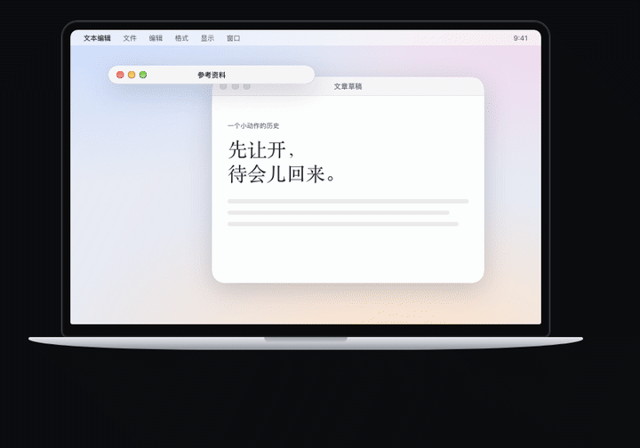

<div align="center">


# WindowShade

**收起窗口，留下位置。**<br>
双击标题栏，窗口收成一条卷帘条，停在原处；再双击，它原样回来。<br>
指针停在卷帘条上，不用展开就能看一眼。<br>
免费开源的 Mac 窗口小工具。

[](https://github.com/surfine/WindowShade/releases/latest)
[](#下载)
[](#下载)
[](LICENSE)

[**下载 Mac 版**](https://github.com/surfine/WindowShade/releases/latest) · [**官网**](https://windowshade.pages.dev/) · [**窗口往事**](https://windowshade.pages.dev/history/) · [English](README.md)

<picture>
  <source media="(prefers-color-scheme: dark)" srcset="assets/readme-desk-dark.png">
  
</picture>

<sub>官网首页的互动示意：「参考资料」收起后，后面的草稿露了出来。<a href="https://windowshade.pages.dev/">去官网亲手试一试 →</a></sub>

</div>

## 让开的办法有三种，只有一种不用回头找

窗口挡住了后面的东西，你多半会关掉它，或者最小化。两种都管用，只是回来的时候要费点工夫。

| | 窗口去了哪儿 | 回来的时候 |
| --- | --- | --- |
| **关掉** | 没了 | 重新打开，再翻回刚才那一页 |
| **最小化** | 进了 Dock | 先在 Dock 里认出它 |
| **收起** | 收成一条卷帘条，还在原处 | 双击卷帘条，它就回来 |

收起和最小化不一样：窗口不离开这张桌面。把卷帘条拖到别处，窗口就在新位置展开。

## 这个双击，比你的 Mac 还老

三十年前的 Mac 用户，大多会这一招。后来系统换了思路，把窗口送进 Dock，它就慢慢被人忘了。我们把这段往事写成了一篇可以动手的长文 **[窗口往事](https://windowshade.pages.dev/history/)**：七章，四个动手实验，14 条原始史料。

1. [先别关掉](https://windowshade.pages.dev/history/#space)：同一张桌面，三种安排，亲手比一比
2. [一个小工具](https://windowshade.pages.dev/history/#origin)：一份 1994 年的用户社群刊物
3. [点两下还是三下](https://windowshade.pages.dev/history/#preference)：改一次当年的控制面板
4. [有了按钮](https://windowshade.pages.dev/history/#button)：拖着收起的窗口换个地方
5. [去了 Dock](https://windowshade.pages.dev/history/#departure)：Dock、Exposé 与 Mission Control
6. [还有人在用](https://windowshade.pages.dev/history/#survival)：便笺至今还留着这一招
7. [回到今天](https://windowshade.pages.dev/history/#return)：旧动作，新的工作现场

读完还可以 [启动一台旧 Mac](https://windowshade.pages.dev/history/#lab)（System 7.5、Mac OS 8、Mac OS X 10.1，由 [Infinite Mac](https://infinitemac.org/) 运行），沿着当年的菜单自己找到这个设置。

今天的 WindowShade 是独立的 Swift / AppKit 实现，借用了老名字和老想法，代码从头写起。它不是 Apple 的产品，也没有用 Rob Johnston、Apple 或 Unsanity WindowShade X 的代码。

## 老动作之外，它还帮你看住每扇窗口

收起，窗口留在原处；看一眼，不用展开就能看到它；带到每张桌面，换了桌面也看得到；置顶，窗口留在最前面；窗口浏览，从 Dock 里把它找出来。都是为了让你知道要的那扇窗口在哪儿，而且不用去了再回来。

**收起窗口。** 双击标题栏或按 `⌃⌘C`，窗口收成一条卷帘条；双击卷帘条展开。收起后的样子可以选“跟原来一样”，也可以选“统一标题栏”。

**在标题栏上滑一下。** 把指针放在标题栏上，用两根手指滑。窗口跟着手指走：往上推，它收成一条卷帘条；往下拉，它铺满菜单栏和 Dock 之间的屏幕，再往上推回到原来的大小。松手才算数，滑到一半往回拉，就当没发生过。滑动时，窗口旁边有一块和系统音量提示同样样式的小浮窗，写着松手会做什么。左右滑占半屏；两指张开也是铺满，捏合放回原处；轻点两下在铺满和原来之间切换。普通鼠标在标题栏上滚三格算一次；Magic Mouse 的支持还在真机上验证。换显示器以后，用手势铺满或占半屏的窗口会照原样排到新屏幕上。网页、列表里照常滚动，Safari 标签上的左右滑照样切换标签；Swish 在运行时，标题栏交给它。细节见 [标题栏手势说明](docs/gestures.md)。

**看一眼。** 指针在卷帘条上停一下，卷帘条下面就挂出一张卡片，按原来的大小显示窗口里的内容；移开，它自己收回去。单击卡片才真正展开。卷帘条留在原处，卡片和它隔着一道缝，一看就知道这是预览，不是窗口本身。它不会切换当前的 App，也不会动任何窗口。收起时被最小化的窗口拿不到实时画面，这时看到的是收起时的画面，右下角会写明。细节见 [看一眼说明](docs/glance.md)。

**带到每张桌面。** 一张桌面放一个 App 的话，按 `⌃⌘G` 把当前窗口带到每张桌面：窗口留在原处，别的桌面右上角会出现它的卷帘条。停在上面看一眼，显示实时画面；窗口被隐藏或最小化时，改显示带提示的截图。单击画面就回到它。再按一次 `⌃⌘G`，或者点卷帘条上的叉，就放下它。

**置顶。** 对着资料写报告、跟着教程一步步做的时候，按 `⌃⌘P` 把那扇窗口置顶，你切到别的窗口，它也不会被盖住。菜单栏里能看到所有置顶的窗口，也能一次全部取消。

**窗口浏览。** 把指针停在 Dock 里的应用图标上，这个应用开着的窗口会一起列出来，每扇都带画面和标题。

- 面板只用来看。按下卡片上的按钮，才会动那扇窗口。
- 选中一扇窗口按空格，打开大图预览。窗口不会被切到前面，也不会移动。
- 左半、右半、四角、居中、填满，或者移到另一块屏幕：先画出窗口要去的位置，你同意了才移动，移好了还能撤销。

也可以从菜单栏的“选择窗口…”打开，或者按你自己设的快捷键。Dock 入口默认关闭，在“设置 → 窗口浏览”里打开。面板是临时的：不替换系统 Dock，也不接管 Command-Tab。细节见 [窗口浏览说明](docs/window-browser.md)。

**彩蛋：合上盖子，桌面留在原处。**



在带铰链传感器的 Apple Silicon MacBook 上，合盖时，屏幕合下来，桌面却像一页纸留在原处，越往上越暗、越模糊；开盖就复原。质感有轻柔、标准、磨砂三种。它只是个彩蛋，收起窗口和置顶都用不着它。

## 五个快捷键，够用了

| 快捷键 | 做什么 |
| --- | --- |
| `⌃⌘C` | 收起或展开当前窗口 |
| `⌃⌘P` | 置顶或取消置顶当前窗口 |
| `⌃⌘G` | 把当前窗口带到每张桌面，再按一次放下 |
| `⌃⌘1…9` | 按菜单里的顺序展开收起的窗口 |
| `⌃⌘0` | 排好卷帘条，或进入专注布局 |

双击标题栏收起，双击卷帘条展开。快捷键都能在设置里改键或关掉；某个组合被别的应用占用时，会提示你一次。

## 下载

到 [Releases](https://github.com/surfine/WindowShade/releases/latest) 下载最新的 ZIP，解压，把 `WindowShade.app` 拖进“应用程序”打开，按提示给权限。它住在菜单栏里，不占 Dock 位置。

- **1.0.15 下载包：** ZIP 4.02 MB，解压后的应用文件合计 7.82 MB（十进制；文件系统实际占用可能不同）。
- **要 macOS 14 以上、Apple Silicon。** 没有 Intel 版。
- **安装包还没公证。** 第一次打开如果被系统拦住，去“系统设置 → 隐私与安全性”点“仍要打开”。不用关掉系统的安全检查。
- 每次发布都附 SHA-256 校验文件。每个版本改了什么，见 [更新记录](https://github.com/surfine/WindowShade/releases)。

## 你的窗口，只留在你的 Mac 上

WindowShade 要两项权限。**辅助功能**：找到、移动、恢复窗口。**屏幕录制**：拍下窗口画面做预览。“屏幕录制”只是系统给这个权限起的名字，画面只在你的电脑上处理，不会传到别处。应用万一意外退出，窗口也会自动恢复原样。

普通窗口都能收起。便笺用系统自己的收起方式；Adobe 这类自己画标题栏的应用会单独处理。全屏、分屏、台前调度和多显示器还有少数情况没覆盖，建议先在你常用的应用里试一次。碰到问题欢迎[反馈](https://github.com/surfine/WindowShade/issues)，写上 macOS 版本、应用名和操作步骤。

## 构建与参与

需要 macOS 14+、包含 Metal 编译器的 Xcode command line tools，以及 Apple Development 签名证书。

```sh
git clone https://github.com/surfine/WindowShade.git
cd WindowShade/prototype
./build.sh --check   # Swift 类型检查与 Metal 编译
./build.sh           # 使用本机配置的身份构建、签名
open WindowShade.app
```

通过 `WINDOWSHADE_CODESIGN_IDENTITY` 或未跟踪的 `prototype/local-codesign.env` 配置签名。签名、隔离构建与发布步骤见 [DEVELOPMENT.md](DEVELOPMENT.md)；界面和官网文案按 [文案规则](docs/copy-guide.md) 写。

| 仓库入口 | 内容 |
| --- | --- |
| [`prototype/`](prototype/) | 原生应用：窗口策略、捕获、覆盖层、效果与恢复 |
| [`tests/`](tests/) | 状态、恢复、帧、Metal 与纸面组件检查 |
| [`site/`](site/) | 部署在 Cloudflare Pages 的中英文官网与窗口往事 |
| [`docs/performance.md`](docs/performance.md) | 实测结果，以及尝试过但没有奏效的办法 |
| [`docs/releases/`](docs/releases/) | 历次发布说明 |
| [`WindowShade.md`](WindowShade.md) | 最初的设计理由与研究笔记 |

修改窗口行为时，请写明应用和窗口类型、修改前后的表现，以及做过的检查。

## 致谢与许可

本项目代码采用 [MIT](LICENSE)。历史软件和名称属于各自作者。窗口往事感谢 [Infinite Mac](https://infinitemac.org/)、Marcin Wichary 的 [《偏好之形》](https://aresluna.org/frame-of-preference/)，以及提供时代外观实现参考的 [AI System 6](https://github.com/surfine/AI-System-6)。随站点分发的字体和参考资源许可保留在 [`site/public/fonts/`](site/public/fonts/)。
