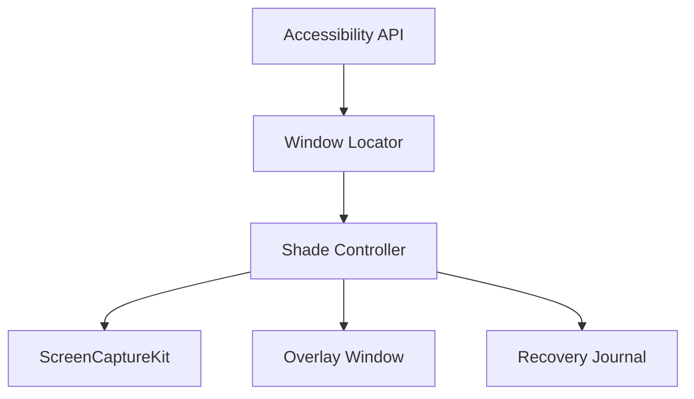

<h1 align="center">
  <br>
  WindowShade
</h1>

<p align="center">
  <strong>把窗口留在原地，暂时收起挡路的内容。</strong><br>
  一个 macOS 菜单栏工具，把经典窗口卷帘动作带回现代桌面。
</p>

<p align="center">
  <a href="https://github.com/surfine/WindowShade/releases/latest"></a>
  
  <a href="README.md"></a>
</p>

---

WindowShade 适合这样的桌面时刻：窗口挡住了内容，但它仍然应该留在你刚才放好的位置。

它会把窗口内容原地卷起，只留下一条可识别、可拖动、可展开的卷帘条。窗口仍然属于原来的应用，不需要去 Dock 里找，也不会打乱桌面布局。

## 三种能力

| 能力 | 作用 | 适合场景 |
| --- | --- | --- |
| **折叠窗口** | 收起窗口内容，只留下标题栏入口。 | 清出桌面空间，同时保留窗口位置和恢复入口。 |
| **置顶预览** | 将窗口显示为实时悬浮预览。 | 参考资料、镜像画面、仪表盘和持续观察的窗口。 |
| **动态效果** | 让桌面或窗口随设备开合产生平滑的卷帘效果。 | 想让窗口状态和设备开合动作保持一致。 |

## 菜单栏和设置

菜单栏负责当前窗口和窗口列表；铰链角度是只读状态。动态效果的开关、样式、触发角度、实时预览和权限状态集中在设置 → 效果。设置中的“随设备倾斜”是实验功能，会在 Mac 暴露 Apple Silicon 传感器时给桌面效果增加轻微空间偏移；它只在桌面效果运行时生效。

## 基本用法

| 动作 | 快捷键 / 手势 |
| --- | --- |
| 折叠 / 展开当前窗口 | Control + Command + C |
| 折叠 / 展开指定窗口 | 双击标题栏 |
| 预览折叠窗口 | 单击卷帘条 |
| 置顶 / 取消置顶当前窗口 | Control + Command + P |
| 按菜单顺序展开窗口 | Control + Command + 1…9 |
| 整理卷帘条 / 专注 shelf（实验功能） | Control + Command + 0 |
| 配置动态效果 | 菜单栏 → 设置 → 效果 |

## 权限与隐私

WindowShade 按功能使用两项 macOS 权限，另加一项实验性的本地传感器读取：

- **辅助功能**：寻找、移动、聚焦和恢复窗口。
- **屏幕录制**：截取标题栏、生成窗口预览和实时效果预览。
- **Apple Silicon 加速度计**：不是系统权限项。“随设备倾斜”开启后读取本机 HID 报告，部分机型或安全上下文会显示为不可用。

实时预览默认关闭，只有用户主动开启时才会检查屏幕录制权限。窗口内容不会上传，也不会离开这台 Mac。

## 兼容性

大多数普通桌面窗口可以直接使用。自绘标题栏的应用会采用专门的兼容策略；全屏、Split View、Stage Manager、多显示器和沙盒应用可能需要额外适配。

动态效果需要机型提供铰链角度传感器（Apple Silicon MacBook）；“随设备倾斜”还要求系统暴露 AppleSPU 加速度计。

## 下载

到 [Releases](https://github.com/surfine/WindowShade/releases/latest) 下载最新版 zip，解压后打开 WindowShade.app。WindowShade 常驻菜单栏，不会出现在 Dock。

各版本更新内容见 [Release Notes](https://github.com/surfine/WindowShade/releases)。签名身份保持不变，覆盖安装即可升级，辅助功能与屏幕录制授权不会被重置。

## 从源码构建

- macOS 14 或更新版本
- Xcode command line tools
- Apple Development 证书（用于签名）

```sh
git clone https://github.com/surfine/WindowShade.git
cd WindowShade/prototype
./build.sh
open WindowShade.app
```

只检查编译：

```sh
./build.sh --check
```

签名身份可以通过 WINDOWSHADE_CODESIGN_IDENTITY 或本机未跟踪的 prototype/local-codesign.env 提供。构建、签名与发布细节见 DEVELOPMENT.md。

## 架构



实际功能分布在 prototype/ 下的 App/、Capture/、Compatibility/、Core/、Overlay/、Private/、Recovery/ 和 Window/ 模块。历史背景见 WindowShade.md。
