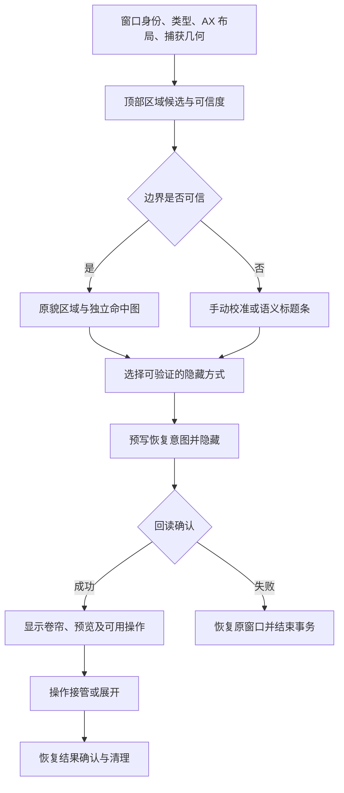

> 历史归档：记录的是 2026-09-13 的判断与进度，不代表当前缺陷或执行指令。后续实现以 Git 历史、现行文档和 [1.0.15 发布说明](../../../releases/v1.0.15.md) 为准。

# 原貌卷帘审视与升级方案

> 后续历史核对已修正本报告的部分建议：近期执行以 [结合修改历史后的计划](near-term-plan-after-history-2026-09-13.md) 为准。此报告中更广的重构、交互改动与校准能力不属于当前实施范围；已有设计选择不能仅凭源码形态判为缺陷。

日期：2026-09-13。范围：当前工作区的原貌截图、顶部区域识别、显示、隐藏恢复、交互及窗口兼容。结论来自源码、用户截图、最近运行日志和 Apple 官方资料；本文是审视与设计方案，不代表列出的应用已经通过实机验收。本轮未继续修改生产算法。

## 结论与产品方向

原貌卷帘值得继续做，但应从“截一条标题栏”升级为“保留窗口身份、可快速操作的折叠窗口”。建议保留截图作为可靠基础，重做顶部区域识别和显示契约，在此基础上分层增加交互。不要以“所有 App 都有可识别的标准标题栏”或“截图上的按钮都能直接操作”为前提。

用户应获得四件确定的事：看得出是哪一个窗口；顶部没有半个按钮或文字；拖动、预览、展开位置可信；需要操作时能迅速回到真实窗口。直播画面和原地按钮操作则取决于具体窗口能力，不应影响基本折叠可靠性。

建议的默认体验：

- 自动保留完整顶部区域，包括必要工具栏；没有可靠边界时不强行切出半截控件。
- 悬停显示内容预览，单击固定预览，双击展开，拖动空白区域移动卷帘。拖动开始前不弹出预览。
- 右键提供展开、置顶、调整保留区域、恢复自动识别、窗口管理。操作名称与真实行为一致。
- 无法自动识别时，允许拖动裁切底边校准，并按窗口类型记忆；用户无需理解 AX 或截图比例。
- 展示原貌时默认不改写原窗口的文字、图标和颜色；新增控制放在独立的小型操作区域，避免覆盖或冒充原有控件。

## 当前实现的事实与缺口

| 优先级 | 发现及证据 | 含义与处理方向 |
| --- | --- | --- |
| P0 | `/tmp/windowshade.log` 的 04:11:54、04:12:06 仍记录 Codex `standardTitleBarOnly=true`、`finalBarH=32`，对应用户报告未修好 | 最近的控件补丁未解决实际案例。不能把构建成功当作修复证据；需要原图、候选边界和识别原因一起复现 |
| P0 | `WindowShade.swift` 的 `windowLooksToolbarlessStandardTitleBar` 依赖交通灯和顶部 AX 控件；`AXWindow.swift` 的 toolbar 搜索深度仅 2，控件扫描深度 6、节点预算 150、每节点最多 40 子节点 | 有界扫描有性能理由，但“未找到”被当成“没有”。应记录完整、截断、不可访问等状态，未知不能触发高置信度标准标题栏判断 |
| P0 | `visualChromeHeight` 只有定义没有调用。`preciseChrome = needsControlPaddedChrome`，后者等价于存在固定高度；`prepareNativeStrip` 却要求“没有固定高度且 preciseChrome”为真才扫描 | 当前常规配置下精细像素扫描条件不可同时成立。不是已经有一套有效的 AX＋图像融合系统；需要重新接通并测试候选生成，而非简单调阈值 |
| P0 | `captureWindow` 按 AX 尺寸设置截图像素宽高，只关闭鼠标；`prepareNativeStrip` 用图片宽度／AX 宽度推算比例，并从图片 `(0,0)` 裁切 | 缺少明确的内容原点、阴影边距和坐标变换契约。代码未显式设置单窗口阴影策略。这是需要实测排除的第二类原因，不能断言本次全由高度造成 |
| P1 | `mirrorRoundCorners` 对整个截图条逐像素取上下镜像 alpha 的更小值 | 会改写源图轮廓。面对大圆角、非对称透明区域或悬浮式顶部，可能把透明缺口镜像到不该裁掉的位置。截图里的异常圆弧需要与原始 alpha 对照 |
| P1 | 有交通灯时 `makeScreenshotOverlay` 使用原生有标题栏窗口，叠加系统交通灯；其余内容仍是 `TitleStripView` 图片 | 同时存在截图 chrome 和宿主窗口 chrome 两套几何。可能出现轮廓再裁切、按钮样式或位置不一致；应验证，不应默认叫做完全原貌 |
| P1 | `TitleStripView` 普通区域只有预览、拖动、双击；原有工具栏图标没有动作映射。交通灯通过先恢复真实窗口再执行动作 | 原貌目前主要是视觉身份，不能因看见工具栏按钮就声称其可交互。通用交互应先提供真实窗口接管 |
| P1 | 原貌截图为折叠时快照；悬停预览另行请求。Codex 的屏外停放失败后回退 app-hide | 保留外观与实时更新是不同能力。隐藏方式必须决定实时预览是否可用，不能不断重试截图假装“实时” |
| P1 | `WindowPolicy` 多数按 bundle／名称分类；Adobe、Quick Look 有额外分型。通用方案入口拒绝全屏、最小化窗口，但没有完整的 sheet／对话框／工具面板能力模型 | 同一个 App 的主窗、设置窗、弹出窗不能共用同一个高度与交互策略。兼容范围应按窗口类型统计 |
| P1 | `interactiveNative` 先改变原窗口尺寸，等待 30ms，再验收最小高度；此分支没有走截图分支的预写恢复意图路径 | 真实缩窗可保留交互，但受最小尺寸限制，也会重排内容。要成为推荐能力，先补上尺寸修改前的恢复事务和失败回滚验证 |
| P2 | 截图缓存 key 含窗口 ID、用途和输出档位，但没有尺寸、外观或窗口代次；chrome 缓存主要按短 TTL、尺寸和 AX 元素判断 | 快速切主题、切标签、工具栏显隐等可能在 TTL 内复用过期结果。应按捕获及布局代次失效；这是风险分析，未声称已复现缓存故障 |
| P0（验收） | 当前 tests 有状态机、恢复、帧元数据、纸面交互测试，但没有直接覆盖原貌裁切判定、圆角镜像或用户失败图片的测试 | 过去测试通过无法证明原貌显示正确。先补可回放的图像＋布局案例，再判断算法是否真的改善 |

相关源码入口：`prototype/WindowShade.swift`、`prototype/Window/AXWindow.swift`、`prototype/Capture/PreviewRenderer.swift`、`prototype/App/OverlayFactory.swift`、`prototype/Overlay/ShadeStrip.swift`、`prototype/App/ShadeController.swift`、`prototype/App/FoldTransaction.swift`、`prototype/App/HoverPreview.swift`、`prototype/Capture/WindowSnapshotCache.swift`。

值得保留的基础：已有折叠状态机、截图请求去重与超时、隐藏结果回读、持久恢复日志、多显示器和 Space 恢复、App 兼容策略入口。无需整体推倒重写。Duo 的 `EffectFrameSource` 已正确区分完整帧和不可用状态，并保存内容坐标及代次，可作为共享捕获层的参考；不要直接复制另一套只检查 sample 有效性的流消费逻辑。

## 四条实现路线比较

| 路线 | 外观与兼容潜力 | 交互能力 | 代价与判断 |
| --- | --- | --- | --- |
| 原貌快照＋语义操作 | 不要求原窗口改变尺寸，适合作为默认基础；裁切算法仍需升级 | 移动、展开、预览、可靠的窗口操作；普通内容通过真实窗口接管 | 推荐主线，资源开销可控 |
| 实时顶部镜像＋能力映射 | 标题、进度可更新；依赖源窗口仍能产出有效帧 | 少量可确认的 AX 动作，复杂操作仍接管原窗口 | 第二阶段按能力启用，不能承诺隐藏后始终更新 |
| 真实窗口缩到标题栏 | 真正使用源窗口，自然保留原生交互 | 最强，但取决于应用接受的最小尺寸 | 作为已验证窗口的增强能力；不适合作为通用默认，禁止反复试缩用户窗口 |
| 修改他人窗口的系统裁剪／WindowServer 私有手段 | 理想上可保留更多真实行为，但当前项目没有可靠实现依据 | 不确定 | 不推荐主线。仓库已有 SIP 环境下相关私有移动／透明度调用无效的实测，不能把这一方向包装成已可行 |

ScreenCaptureKit 能捕获被遮挡、移出屏幕的单窗口，但 Apple 明确说明最小化会暂停输出。它也不自动把单窗口的弹出窗一起变成交互界面。因而“有流”不等于“所有隐藏策略下都可实时”，更不等于“截图可直接点”。参见 [Apple WWDC22 单窗口捕获说明](https://developer.apple.com/videos/play/wwdc2022/10155/)。

## 建议架构：先识别窗口能力，再生成折叠计划

建议拆出四个小模型，按阶段引入：

- `WindowDescriptor`：窗口 ID＋进程启动身份、role/subrole、文档与模态关系、布局签名、可读属性／动作。跨会话不要只存窗口 ID。
- `ChromeAnalysis`：多个候选底边、候选来源、扫描完整性、选择理由、内容坐标变换、源 alpha；不要只返回一个 CGFloat。
- `FoldCapabilities`：可否移动、缩放、最小化、捕获、持续更新、执行特定 AX 动作、独立于父窗口存在。按窗口动态判断，应用规则只补充证据。
- `FoldSession`：截图／流代次、实际隐藏方式、原始几何、恢复意图、操作中状态、最新有效帧。原貌、预览和点击共同引用同一代布局。

### 顶部边界怎样做得更稳

1. **先统一捕获几何。** 显式设定阴影策略；记录 AX frame、SCWindow frame、filter 内容几何、输出像素尺寸和实际内容原点。用无阴影窗口内容做分析，阴影只在展示层处理。不能从图片宽度一个值推断所有坐标关系。使用流时复用已验证的内容元数据换算；截图 API 没有相同附件时走专用、经过验证的几何路径。
2. **生成多个独立候选。** 自身窗口使用 AppKit 的真实内容边界；外部窗口尝试 AX 工具栏、标题相关控件组、交通灯、图像中的完整控件带与横向分隔线。固定应用高度只作为限定版本／类型的先验。AppKit 的 `contentLayoutRect` 仅适用于本进程持有的窗口对象，不能推广成读取其他 App 的 API。[Apple 文档](https://developer.apple.com/documentation/appkit/nswindow/contentlayoutrect)
3. **让“没有找到”保持未知。** 扫描节点预算耗尽、AX 未实现、未返回 toolbar，都不能证明窗口只有 28／32 点标题栏。针对顶部可见区域剪枝，按需扩大局部搜索，避免盲目增加整棵树深度。
4. **避免控件簇连到正文。** 现有以垂直间隔连续合并的方式，可能把工具栏、侧栏按钮、正文首行连在一起。候选应保留横向位置、父容器、角色及所属区域，不能只有 minTop/maxBottom。图像边界也不能只看白色块，否则深色、透明和渐变界面失效。
5. **约束优先于评分。** 选中的底边不能穿过已确认的标题控件；必须包含必要留白；不能吞入明显的正文行。对多排工具栏提供“仅标题区／完整工具区”的校准，而非把所有窗口拉成同一厚度。AX 与图像一致时自动采用；冲突时保持低置信度，不编造可靠结论。
6. **给用户快速校准。** 在短暂显示的原图上拖动下边界，预览最终卷帘；支持重置。按 bundle＋版本范围＋窗口类型／布局签名记忆。窗口换结构或版本时重新验证，不能把一次校准套用整个 App。
7. **原貌轮廓与装饰分开。** 上缘保留源 alpha，底缘可采用小圆角，但不再把整条图上下镜像。透明悬浮式顶部本身不应一律被当成坏截图；可信时保留其形状，不可信时明确降级。比较无边框宿主＋语义命中区域与当前原生标题栏宿主，确认哪种不会二次裁剪。

视觉分析优先采用确定性几何和图像规则。OCR 可在离线诊断中辅助发现被切断文字；不建议第一阶段把视觉模型或网络服务放到每次折叠的热路径中。

## 互动性：优先做有用且可靠的动作

| 能力 | 推荐交互 | 实现边界 |
| --- | --- | --- |
| 看内容 | 悬停预览；单击固定；Esc 关闭 | 静态与实时明确区分。不要因为 idle 没有新帧就误判断流；blank/suspended/stopped 另行处理 |
| 临时操作 | 从预览进入真实窗口，完成后显式点击“再次折叠” | 第一版不在失焦时自动折回，避免打断菜单、文件选择器、输入法或未保存对话框 |
| 窗口管理 | 展开、关闭、最小化、全屏、置顶、移动到目标显示器 | 基于当前能力显示；请求后验证结果。已有交通灯恢复再执行机制可沿用改进 |
| 原工具栏按钮 | 仅对可重新解析、支持动作且结果可验证的控件提供映射 | 先选有限动作原型；AX 返回超时不代表动作未执行，不能对开关、关闭等盲目重试 |
| 搜索、文本编辑、拖放、复杂菜单 | 展开原窗口操作 | 不用截图上的坐标投递冒充通用原生交互；弹出层还涉及窗口关系、焦点及捕获范围 |
| 实时状态 | 按需更新标题、进度及缩略图 | 多窗口统一调度，悬停时提高更新频率；最小化暂停时退回最后有效帧并说明状态 |
| 无障碍与键盘 | 卷帘作为可聚焦窗口项，暴露名称、展开和管理动作 | VoiceOver／键盘操作不应依赖截图中文字和鼠标坐标 |

Apple 的 AX 动作接口是“请求执行支持的动作”，可能返回不支持、对象失效或超时；官方特别指出超时并不必然意味着动作失败。这支持能力探测＋结果验证的方案，而不是通用盲点透传。[AXUIElementPerformAction](https://developer.apple.com/documentation/applicationservices/1462091-axuielementperformaction)

## 覆盖范围应按窗口类型验收

以下是测试与适配计划，不是已支持清单。共同维度采用代表性组合，不做所有维度的笛卡尔积：浅／深色、激活／非激活、Retina／非 Retina、主／副屏、窄／宽窗口、工具栏显隐、同 App 多窗口、切 Space、减少透明度。

| 窗口类型 | 代表应用／场景 | 目标与处理 |
| --- | --- | --- |
| 简单原生标题栏 | Terminal、TextEdit、普通文档 | 第一批基线，完整保留标题／交通灯，不吞正文 |
| 统一工具栏／浮动侧栏 | Finder、系统设置、WindowShade 设置、Preview | 第一批重点，顶部高度不以交通灯独断；标题工具区完整 |
| 浏览器多排顶部 | Safari、Chrome，标签／地址栏组合 | 按布局识别顶部行，分别覆盖紧凑模式、标签变化、工具栏隐藏 |
| 自绘桌面窗口 | Codex、VS Code、Discord、Claude 等候选 | 先确认各自实际实现与 AX 暴露，不按产品名称假定都是同一种框架；低置信度时可校准 |
| 聊天／搜索窗口 | 微信、Telegram，主窗／会话窗／设置窗 | 同 App 分类型，逐步替换整 App 固定高度 |
| 创作工具 | Photoshop、Illustrator、AE、Premiere、Pixelmator Pro | 主文档、欢迎页、工作区和工具面板分开；保留现有已知规则直到新方案有证据替代 |
| 辅助／浮动面板 | 检查器、调色板、无标题工具窗 | 缺乏独立标题／稳定恢复能力时不独立折叠；可研究与父窗口成组管理 |
| 模态与 sheet | 保存、导出、登录、权限对话框 | 第一阶段暂停父窗口折叠或显式拒绝，不能把弹窗遗留在原地或藏掉未完成操作 |
| Quick Look／临时预览 | Finder 空格预览 | 单独评估关闭再重开是否保持语义；不要把现有特殊路径当成普通窗口等价替代 |
| 视频／无边框／游戏 | QuickTime、无标题播放窗、游戏 | 有稳定身份但无顶部区域时提供语义条；捕获受限则不伪装原貌；不强制缩窗 |
| 全屏／平铺／跨 Space | 原生全屏、分屏、Stage Manager | 先保留明确边界；普通多屏恢复优先。成组与全屏折叠单独做实验，不默认退出全屏 |

“涵盖更多”应同时统计自动原貌成功率、可校准成功率、安全降级率和不支持原因。一个窗口能安全降级，不代表它已通过原貌验收。

## 分阶段落地与验收

### 阶段一：把失败变成可回放案例

建立只在诊断时导出的本地案例包：源顶部图、raw crop、最终显示图、AX 顶部控件矩形／角色、扫描截断状态、捕获几何、候选边界和选择理由、系统／应用版本。默认不导出正文、文档路径和完整 AX 文本；需要人工挑选和遮挡的图片不得自动提交仓库。

把用户这次设置窗、Codex 窗口列为首批失败案例，保留“失败”状态。CUA 明确禁止操作 Codex 自身，不能绕过限制；可由用户触发折叠产生诊断案例，算法随后离线回放。其他允许操作的测试窗口由自动化验证。

完成判据：每张坏图都能定位到“坐标映射、候选遗漏、候选选错、轮廓处理或宿主窗口二次裁切”之一；不是只有一行 finalBarH。

### 阶段二：升级原貌内核

显式捕获几何 → 候选分析 → 可信度与降级 → 独立轮廓渲染 → 手动校准。沿用原有隐藏／恢复事务，限制变量数量。最近两次局部补丁视为未验收改动，待案例验证后决定保留或替换，不直接继续叠加规则。

完成判据：首批实际失败案例不截断控件；简单标题栏不因新规则多截正文；透明圆角不生成新缺口；1×／2×输出一致；校准可保存及撤销。先建立基线再设成功率目标，不预报未经测量的覆盖率。

### 阶段三：预览与真实窗口接管

统一卷帘、置顶和 Duo 可共用的捕获身份、内容几何及最新有效帧机制，但保留各自生命周期。实现按需预览、固定预览、明确进入原窗口操作、返回折叠。隐藏后不能产帧的会话停止无意义重试。

完成判据：菜单、输入法、模态框不会被自动折回打断；旧代次帧不能覆盖新窗口；预览关闭后停止对应工作；普通空闲卷帘不新增常驻动画时钟。

### 阶段四：有限原地操作与扩充应用矩阵

选少量已确认的 AX 动作验证，然后按窗口类型扩大。真实缩窗模式仅针对可接受尺寸、可完整恢复的窗口启用，修改前写入恢复意图。涉及几何／隐藏／恢复的改动运行现有 Duo 与 journal 检查，并增加对应行为案例。

完成判据：无重复动作、失败有明确退路、打开的原生菜单与对话框位置正确；重启恢复、App 退出、源窗口关闭、快速反复折叠不遗留假窗口或丢失几何。

### 验证重点与性能预算

- 图像回放：测试实际候选选择，覆盖深色、透明、大圆角、自绘工具栏、多行顶部及无控件窗口；验证已确认控件不被边界穿过。不能只测试新增 helper 返回了一个大于 28 的数。
- 实机比较：正常窗口与折叠窗口同一缩放比例，对照文字／图标完整性、上下留白和圆角；检查控件命中位置，而非只看截图存在。
- 事务验证：截图成功但隐藏失败、异步期间窗口关闭、原窗口出现 sheet、跨屏恢复、崩溃恢复。
- 性能按阶段记录 P50/P95：AX 识别、捕获、图像分析、隐藏验证、首次可见。沿用 `docs/performance.md` 的实测成本，不重试已证伪的私有方案，不以增加无界 AX 扫描换兼容。
- 流资源按可见预览需求分配，不给每个折叠窗口开启持续高帧率捕获；监听源停止后释放资源。

## 近期决定

推荐首先交付“诊断回放＋原貌边界与轮廓修正＋可记忆校准”，随后才做实时和按钮映射。它直接解决当前用户可见失败，也为更广的应用兼容建立可验证的基础。

本轮完成的是源码审视和方案。没有宣称当前裁切已修好，没有批量修改用户窗口，也没有把未知应用列入已支持名单。

## 官方资料及本地依据

- [ScreenCaptureKit 单窗口输出、遮挡／屏外／最小化行为与帧几何](https://developer.apple.com/videos/play/wwdc2022/10155/)
- [SCStreamConfiguration：sourceRect、输出尺寸等](https://developer.apple.com/documentation/screencapturekit/scstreamconfiguration)
- [NSWindow.contentLayoutRect](https://developer.apple.com/documentation/appkit/nswindow/contentlayoutrect)
- [AXUIElementPerformAction：动作支持与超时语义](https://developer.apple.com/documentation/applicationservices/1462091-axuielementperformaction)
- 本机 Xcode SDK `ScreenCaptureKit.framework/Headers/SCStream.h`：`ignoreShadowsSingleWindow`（macOS 14+）；`includeChildWindows` 注释限定 display-bound windows/applications，不能假定它解决 desktop-independent 单窗口菜单捕获。
- 项目 `docs/performance.md`、上述源码与 2026-09-13 运行日志。Apple 旧 WWDC 资料用于基础模型；具体隐藏状态和新系统窗口形态仍需在目标系统实测。
