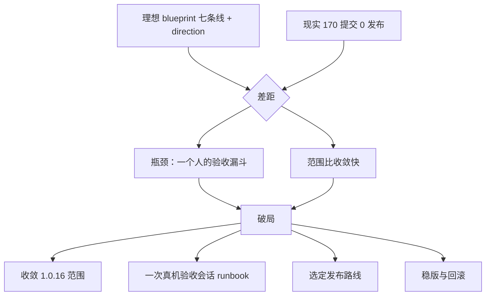

# 理想 vs 现实：检讨、GPT-6 Pro 审议包、落地方案

> 这一包只做三件事：把「1.0.15 之后 170 个提交、0 次发布」的差距讲清楚，做成一份能整段贴给 GPT-6 Pro 的自包含审议包，再附一份待回填的破局落地方案。
> 这一包不改产品代码、不签名、不发布、不派工。

日期：2026-10-06 · 基准：`v1.0.15`（2026-09-26）→ HEAD `v1.0.15-170-gc4a585f`

## 这一包怎么用

1. 想先自己看清差距：读 [GAP-REVIEW.md](GAP-REVIEW.md)。
2. 要把问题交给 GPT-6 Pro：把 [PROMPT.md](PROMPT.md) 整段（连同 [BRIEF.md](BRIEF.md) 的内容一起）复制粘贴。`BRIEF.md` 是自包含的，不依赖仓库链接也能读懂。**（2026-10-06 已送出并取得答复。）**
3. GPT-6 Pro 的答复已回填到 [LANDING.md](LANDING.md)：六处「待 GPT-6 回填」、候选与裁定的四处分歧、改动后的 T1–T13 工单，原文完整留在文末。**下一步是照 T1–T13 派工，重点见裁定里的第一件事实：让一个冻结的 1.0.16 候选包真正完成一次外部用户从 1.0.15 的升级。**

贴给谁：ChatGPT / Codex 里选 GPT-6 那一档（内部标识 `astra` / `gpt-6-astra`）。

## 一页摘要

**理想。** [`docs/direction.md`](../../direction.md) 说的「刘海是 Mac 的新入口」，[`docs/blueprint.md`](../../blueprint.md) 的七条产品线与 0–7 阶段、12 条硬要求，加上 [`docs/releases/v1.0.16.md`](../../releases/v1.0.16.md) 草稿里承诺的整批功能：看不见的窗口都在刘海里、侧拉分屏画中画启动台、排窗、按窗口切换、更省电、实时活动、配件电量、Touch ID、锁屏开合、面部动作。目标是**做成，不是「本地已做」**。

**现实。** `v1.0.15`（2026-09-26）之后，分支上 170 个提交、`main` 上 141 个提交，`git tag` 里最新的仍然是 `v1.0.15`：**0 次发布、0 个新 tag**。窗口这条主线基本走完并在签名构建上跑过真机探针，但 10/2–3 又改过刘海与「看一眼」，要重跑；其余六条线里，实时活动、配件电量、Touch ID、锁屏开合、面部动作只是「已进 App」，离 v2–v4 规格的目标还差整段。构建侧 W00 已并进 `main`（`cc6c938`），`build.sh --check` 退出 0，但还压着 204 处降级警告，且把主线程隔离加到系统回调入口带来的执行期崩溃风险**在真机上没验过**。

**差距的一句话。** 瓶颈已经不是工程产能，而是**一个人的验收漏斗**，叠加**范围比收敛快**：每开一条新线都是往漏斗里加东西，没有从漏斗里拿走（探针在有人用电脑时必须自停、Touch ID／配对／相机／真插拔都等 Aaron 在场）。同时发布侧还缺 Developer ID／公证、真实 Sparkle 更新没走、更新私钥的**恢复能力没验过**（已有一份离线备份，但没人证明它能恢复签名能力）。

**要 GPT-6 Pro 答什么。** 八个待决问题，核心是：1.0.16 该收敛到哪、验收漏斗怎么解、发布走哪条路、W00 执行期风险怎么暴露、七条线该不该并行、只在 Aaron 在场才能做的实验怎么排、用什么当「已做 vs 已发布」的单一事实来源、以及只能再做一件事时做什么。详见 [BRIEF.md](BRIEF.md#八个待决问题)。

## 既有材料的阅读次序

| 次序 | 文件 | 读它看什么 |
| --- | --- | --- |
| 1 | [`docs/blueprint.md`](../../blueprint.md) | 七条产品线、刘海仲裁顺序、做的顺序、12 条硬要求 |
| 2 | [`docs/direction.md`](../../direction.md) | 方向、1.0.16「不发布、先建起来看」的口径 |
| 3 | [`docs/releases/v1.0.16.md`](../../releases/v1.0.16.md) | 1.0.16 草稿承诺的功能集 |
| 4 | [`docs/releases/v1.0.16-ledger.md`](../../releases/v1.0.16-ledger.md) | 逐条「当初的愿景 vs 现在」 |
| 5 | [`docs/releases/v1.0.16-checklist.md`](../../releases/v1.0.16-checklist.md) | 源码／单测／真机探针／人工未验 四类状态 |
| 6 | [`docs/windowshade-requirements-status.md`](../../windowshade-requirements-status.md) | 身份认证、解锁、离位防盗那条线的逐条状态 |
| 7 | [`docs/scorecard.md`](../../scorecard.md) | 自评分数与「凭什么／还差什么」 |
| 8 | [`docs/handoff/FINAL-HANDOFF.md`](../FINAL-HANDOFF.md) + [`round2-part10/REVIEW-HANDOFF.md`](../round2-part10/REVIEW-HANDOFF.md) | 第十份收尾、W00 构建门槛与真机矩阵 |

## 本目录文件

| 文件 | 作用 |
| --- | --- |
| [README.md](README.md) | 入口与一页摘要（本文件） |
| [GAP-REVIEW.md](GAP-REVIEW.md) | 理想 vs 现实逐条对照、差距本质、过程检讨 |
| [BRIEF.md](BRIEF.md) | 自包含审议包（背景、差距、约束、缺口、八个问题、输出格式） |
| [PROMPT.md](PROMPT.md) | 可整段复制粘贴的提示 |
| [LANDING.md](LANDING.md) | 候选破局方案 A–F、工单清单、待 GPT-6 回填位 |

## 护栏（这一包没做什么）

- 没签任何名、没发布、没推 Release、没替换日常 App、没派工给 GPT-6（由 Aaron 复制粘贴）。
- 没改产品代码；`film/ws2-opus/` 与工作区里其余未提交改动一律没碰。
- 文中每个数字都能用括号里的命令或文件复核；没有把「源码存在」写成「已做」，没查证的数不写。
