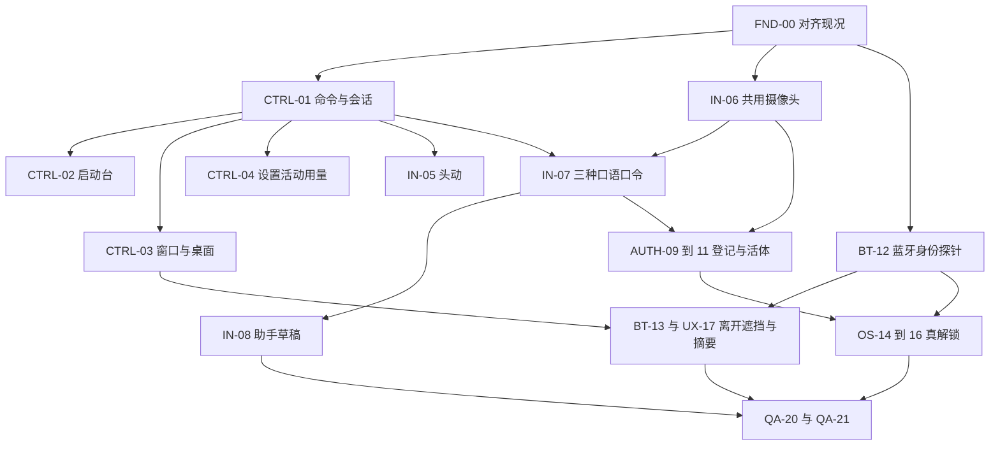

# WindowShade 2.1

2026-10-04。静音操作长在已有的刘海里；刷脸解锁仍以真正解开系统为终点。本文是计划，不是补丁，也不是已经测过的结果。

WindowShade 2 仍是现在这条线：一个刘海、一套动作、指挥模式、输入、番茄钟、菜单。2.1 加在它上面，沿用已经合入的决定。

规格来自 2026-10-03 的执行包。v1（78 条命令）只作归档。v2 是执行目录：142 条计划命令、24 项首轮构想、22 张主线工单、237 条计划验收。规格里另有一张手机工单，用户已确认不需要，不进 2.1，也不留成以后的阶段。v2 自己的检查只证明规格内部一致。没有跑过 Mac、摄像头、AirPods、蓝牙或系统解锁。

机器可读目录在本机，不抄进本文：

- v2：`/Users/aaron/Downloads/WindowShade-Silent-Identity-Spec-v2.zip`
  - 命令：`06_COMMANDS.json`
  - 工单：`08_WORKORDERS.json`
  - 验收：`09_ACCEPTANCE.json`
  - 构想对照：`07_IDEA_TRACEABILITY.json`
- v1 归档：`/Users/aaron/Downloads/WindowShade-Silent-Control-Spec-v1.zip`

读码时的 WindowShade 提交是 `d0d9925410d38abc1beb573714a832568272c562`，Glance 是 `b97f521397ec1197ba17768ba797cae1e628848d`。开工时改对当时的实际 HEAD。已经修过的，不再打第二个补丁。

相关规格：[blueprint.md](blueprint.md)、[face-unlock.md](face-unlock.md)、[dynamic-lock.md](dynamic-lock.md)、[copy-guide.md](copy-guide.md)。文案用固定词：收起窗口 / 展开窗口、卷帘条、置顶、看一眼、收进刘海 / 放回、左半屏 / 右半屏 / 铺满屏幕、启动台、主屏幕、App 资料库、实时活动、番茄钟、指挥模式。功能名就叫**静音操作**和**刷脸解锁**。

## 用户能完成的一件事

不能出声时，提出一个要求，看清电脑的理解，点头让它继续。转向别人时，事先选定的内容收起来。回到电脑前，对上本人、对上身边那台设备，系统真的解开，窗口还在原处。

嘴选择功能，刘海说明对象，头部动作选择或确认，系统认证决定放不放行。识别器只报告看到了什么。点头确认的是刘海上刚刚展示的这一笔。看到一张脸，还不是解开了这台 Mac。

静音操作长在已有的刘海面板里。不另做输入法，不另开窗口，不另做一套刘海。

## 和现况怎么接

共用热点只有一个整合人改：`prototype/App/WS2AppRuntime.swift`、`prototype/App/NotchLeases.swift`、`prototype/Core/InteractionCoordinator.swift`，以及恢复与授权。其余放在新的适配器里。

开工时先核这两处，没修才补：

- `WS2AppRuntime.open()` 在番茄钟空闲时会开始计时。看剩余时间走只读入口；开始番茄钟才是开始。
- 本地助手的岛内容名 `ownedCodex`、`ownedModelPicker` 要和 `NotchLeaseHub`、`InteractionCoordinator` 的准入表一致。两表一起改。展示被拒绝，就补登记。为了让页面出现而拆掉白名单，不做。

[handoff/MAIN-MODEL-DECISIONS-2026-10-04.md](handoff/MAIN-MODEL-DECISIONS-2026-10-04.md) 的 D11 继续管当前分支：人脸可以做实验，不接系统解锁；声纹这轮不做。2.1 仍以真正解开系统为终点。资格没过之前，自动代填保持关闭。

[face-unlock.md](face-unlock.md) 继续有效：同一个刘海宿主，两样都对才代填，先做蓝牙第二因素，系统永远是出路。用户已确认不需要 iPhone 或 Apple Watch 配套 App：2.1 不做，也不留成以后的阶段。系统解锁、蓝牙证据、屏幕距离仍在这台 Mac 上完成；没有手机 App 来当第二个界面。v2 对它的修订如下，不另起一份规格：

- 「连上」要拆成证据等级。名字相符、UUID、RSSI、GATT 有回应，都还不是「就是那一台」。
- 11.5 秒是 1.5 秒宽限加 10 秒倒数，不是从人走开那一刻算起的总延迟。心跳、超时、系统上锁另计。
- 声纹不进 2.1。活体用这一次随机的口型和头动。语音不顶替手机或手表。
- 口令录制、安全挑战、脸的模板、秘密口令实验分开存。一份通过，不带来另一份的资格。

## 三种输入，互不借用

同一个静音入口，同一时刻只有一种模式：`command`、`dictation`、`securityChallenge`。切换就清空缓冲。挑战里的点头、口型，以及解锁前排着的输入，解锁后全部作废。同一次点头不能又开锁又打开应用。

- **看。** 直接显示。没有实时活动就说明没有。用量没有数据写「未提供」，不写成 0，也不写成 100%。单次会话用量、账户额度、上下文占用分开，不混成一个数。
- **改。** 改窗口、播放或番茄钟之前，先冻结对象并给出预览，再接受预览出现之后的新点头。再说一次「左半屏」，仍然是左半屏，不把刚做完的排布反过来。对象中途没了，这条建议作废，不去抓当时的焦点窗口。
- **交给助手。** 采用这段文字，和发送这句，是两次动作。没有绑定的会话，就停在这台 Mac 上的草稿。审批仍走现有授权账。头动只能把人带到原来的审批页。

摄像头只有一个协调者。现有几何观察大约每秒 8 次，不能把同一帧复制成唇读要的每秒 25 帧。几何、口令、挑战各取自己的帧。关掉一个用途，不关掉另一个仍开着的用途。

默认不占全局快捷键，不常驻唇读，不开麦克风。轻声辅助是另一项要单独打开的选择。

菜单仍是启动台，然后是窗口、实时活动、用量、设置。常用操作在静音会话里可以直接到达。完整列表不摊进一级菜单。

## 做的顺序

前一段可以单独试用。后一段不挡住前一段。

| 段 | 工单 | 用户能试的 | 这一段算做完 |
| --- | --- | --- | --- |
| 1 点就能用 | FND-00，CTRL-01～04 | 启动台、左半屏、右半屏、铺满屏幕、收起窗口、看一眼、设置、实时活动、用量 | 点击走通；重复打开启动台仍保持打开；铺满屏幕不进入系统全屏 |
| 2 头来确认 | IN-05 | 候选出现之后点头采用、摇头取消 | 低头看键盘不会确认；耳机断连只停动作 |
| 3 自己的口令 | IN-06，IN-07 | 普通话、粤语、吴语各录自己的少量口令 | 第一次只要求 6 个；没录过的不显示成已经会认 |
| 4 助手草稿 | IN-08 | 短句草稿、看清、再发送 | 采用和发送分开；停止要等后台确认 |
| 5 身份与身边的设备 | AUTH-09～11，BT-12 | 登记本人；蓝牙探针写出证据等级 | 做不到的层级写明卡住在哪；不把连接写成身份 |
| 6 解开并恢复 | OS-14～16，BT-13，UX-17，UX-18，QA-20，QA-21 | 离开倒数、遮挡、系统确实解锁后的离开期间摘要 | 三条路径有真机证据；资格没过就不打开自动代填 |

### 1. 点就能用

FND-00 对齐实际 HEAD、准入表和番茄钟只读入口。CTRL-01 把命令收成封闭目录：同一次只作用于冻结好的对象，确认过期就作废。

CTRL-02 接现有 `LaunchpadController.navigate(to:)`。目的地用已有的主屏幕、负一屏、App 资料库、系统搜索、返回。静音入口传入目标显示器和进来之前的 App。`show()` 不再按鼠标所在的屏幕猜测。「打开启动台」是打开；连续触发保持打开。「回到主屏幕」「回桌面」、关闭文件夹、返回上一层，是四件不同的事。

CTRL-03 接现有窗口引擎。左半屏、右半屏、铺满屏幕、居中、还原、收起窗口、展开窗口、置顶、收进刘海、放回、看一眼、侧拉、画中画、魔法平铺、卷轴，都用明确的目标状态。看一眼不改窗口位置，不抢走正在编辑的焦点。桌面和物理屏幕分开；平台给不出身份，就保持未知，不造一个桌面。

CTRL-04 复用现有设置和实时活动。查询不开始播放、不开始番茄钟、不发起模型任务。用量沿用 `WS2OwnedCodexSession` 已有的那一条通道，只读，不另开连接，也不为了查额度去跑一次模型。

### 2. 头来确认

IN-05 移植 HeadOrbit 的校准、停留和迟滞。不移植它的全局 Return、按键注入，和它自己的模糊层。

点头是从回正出发、完成下点、再回正。动作开始得晚于候选出现。摇头是拒绝这一笔。动作只在当前这一页里有效。断流、单耳、换耳、耳机切到手机、样本过期，都清掉还没用的确认。断线不揭开已经遮住的内容。

### 3. 自己的口令

IN-06 让几何观察、口令和安全挑战共用一次物理采集。IN-07 先做个人小词表。第一次 6 个：四个入口，加上一项、下一项。其余功能用「上一项、下一项、选这个」到达，或直接点。

普通话、粤语、吴语各有自己的档案。界面的简体或繁体，不让模型获得那种口语的识别能力。吴语保存用户选择的地域变体和本人录下的口令，不另编一套通用读音。两个口令分不清，就减少同一页上的命令，或改由头动去选。个人口型比对是待验证的基线。

没有麦克风回退。纯静音失败，不偷偷打开麦克。

### 4. 助手草稿

IN-08 接现有指挥模式和已绑定的会话。短句表达要怎么处理；精确到哪一段，靠编辑器里的选区或用户点选的符号。否定、数字、路径留在候选里。点头「采用文字」不发送。允许发送的后端要已有绑定会话、真实能力和回执。没接上的后端只留本地草稿。

换模型、换思考档位，只影响后端允许的下一轮，不当场发起一次推理。停止先显示正在请求停止，后台确认之后才写已停止。高风险批准交回原来的单次授权。

### 5. 身份与身边的设备

AUTH-09 在刘海里登记本机账户的主人。模板加密存在本机。照片登记拒绝。换人、跟踪中断、摄像头换源，这一次尝试作废。

AUTH-10 每次临时出题，逐步显示。从用户已经能稳定完成、系统也能分开的视觉类别里抽两个不同的，再加一个随机方向的小幅转头，顺序也变。识别器在全部已登记类别和非口令样本之间分辨，再由本机核对是不是这一步要的。不能把预期答案先交给识别器。安全挑战不经过语言模型润色。

AUTH-11 在用户打开这项加强之后，用 AirPods 的动作和画面里的转头对时间与方向。缺了这项已启用的证据，这一次就取消，不在中途跳过。耳机在动，不是某人身份的证明。

BT-12 按 [face-unlock.md](face-unlock.md) 的 F1：不装配套 App，只在这台 Mac 上做原生蓝牙探针。能证明到哪一层，就写到哪一层。证明不了身份，自动解锁就不准入。ANCS 不是签名接口。

### 6. 解开并恢复

BT-13 接 [dynamic-lock.md](dynamic-lock.md)：手机和手表都离开，1.5 秒宽限，刘海倒数 10 秒，碰一下就取消，倒数完才请求锁定。信号瞬间波动不直接锁。手动锁、紧急遮挡、锁来源未知，不自动回来就开。

UX-17 遮住的是用户选定的那一组，连同看一眼、画中画、窗口浏览缩略图和刘海里的私密文字。哪一层还盖不住，就列出来。断流保持遮挡。恢复另走当前的保护策略。脸消失不自动算作安全，也不算解开。

OS-14 在锁屏上仍用原来的刘海。只增加一条狭窄的验证状态。普通页面在锁屏时继续不出现。系统的密码框不被挡住。连续 3 次失败，这一次锁屏只用 Touch ID 或密码。

OS-15 的限时凭据和现有 `AuthorizationLedger` 分开。原来的授权在锁屏时仍然失效。凭据会话要用户在已经解锁时主动建立，并说明会暂时留下解开能力。初始期限按规格里的 15 分钟会话、锁后 5 分钟，真机测完再冻结。手动锁、紧急遮挡、换账户、应用重启、登记或凭据变化，都撤销。

OS-16 才接系统后端。Glance 的 `typeAndReturn()` 不进生产。视觉模块拿不到密码，也不能选择往哪个进程输入。同一笔只提交一次。结果未知，不重试，不清空再填。只有系统状态变成当前账户已解锁，才展开桌面并显示离开期间摘要。摘要每项能点到对应的窗口或设备，不补播旧提醒。FileVault 开机前、别的账户、认不出的系统画面，都不由这条流程代填。

UX-18 把摄像头的各项用途分开征得同意。删掉档案、模板和设备登记时，一起撤销还没用完的许可。键鼠和系统登录始终留着。不能点头、转头或张口的人，走同一条产品路径。

QA-20、QA-21 收三条真实路径、攻击和能耗。对外说法只写测过的。不写和 Pixel 同一级，也不写录像解不开。

APP-22 不进 2.1，也不留成以后的阶段。它不用来补蓝牙身份还没证明的缺口。主线仍走 Touch ID 或密码。

CarPlay 只保留进入和离开，接到已经准入的接收器。遥控器连上，不写成 CarPlay 能接收。

## 三条必须走通的路径

- **A.** 打开静音操作 → 打开启动台 → 主屏幕或 App 资料库 → 打开一个真实 App → 焦点回到进来之前的地方。
- **B.** 对事先选定的窗口给出左半屏 → 预览 → 新的点头 → 位置真的变了；选定的助手会话里形成草稿 → 看清 → 明确发送 → 收到后台回执。
- **C.** 登记本人 → 受控锁屏 → 同一张脸做完这一次随机口型和头动，加上已核实的设备 → 合格后端只提交一次 → 系统确实解锁 → 窗口和离开期间摘要恢复。摄像头、蓝牙、凭据、系统结果分开交证据。

## 状态怎么写

一条能力只标下面之一：`planned`、`implemented`、`simulated_pass`、`hardware_pass`、`qualified`、`blocked`。模拟通过不升成资格通过。模型、摄像头、系统版本、设备证据或凭据后端变了，相关资格撤销，不沿用旧报告。

300 次独立攻击尝试且零次成功，单侧 95% 置信上界仍约为 1%。相邻帧不算独立尝试。不能写成攻击成功率是零。

## 多前置镜头

这条同时约束 WindowShade 2 的那一个刘海宿主，见 [blueprint.md](blueprint.md)。不另做一套刘海，也不另做常驻选择器。规则在 `prototype/Core/WS2CameraChoice.swift`，还没接上采集。

现在菜单「检测面部动作」由人点一台相机，按 `uniqueID` 打开。探针只在恰好一台传输为内建时自动选。这台机器上 Studio Display 报 `builtInWideAngleCamera`，传输是 USB，不会被当成那台内建。序号只用于诊断。

系统给出的对应关系：

- `AVCaptureDevice` 没有显示器 ID。`systemPreferredCamera` 是整个 App 的一颗偏好，跟着连续互通和用户历史变，不是「这块屏幕的镜头」。不拿它当主镜头。
- `kCMIODevicePropertyLocation` 只给粗类：内建屏幕、外接显示器、线缆设备、无线、未知。它不给 `CGDirectDisplayID`。只有一块外接屏时，「外接显示器」这一类可以对上那一块。两台外接都落在同一类时，是哪一块，未知。这台机器还没读过这个属性。
- 名字像 Studio Display，不等于就是上面那一块。

平时自动，不问。问一次只发生在主镜头对不上这块屏幕、而且认不出人、并且还有另一颗前置时。记住这次选择。距离一直未知、但主镜头已经对上这块屏幕时，距离保持未知，不发问。不为了两颗一起看而发问。新镜头接上的当下不发问，也不打断当前操作。

人正在看的屏幕，先是刘海所在的那块；刘海不在，才跟焦点窗口。不用鼠标。只有一颗前置就用它，辅助是 unknown，不提示再接一颗。镜头对得上这块屏幕，就用这块屏幕上的那颗。两台并排，只有已经对上其中一块时才跟着换，换的时候不问；对不上就沿用这组排列上次成功的那颗。笔电在下、外接在上：看上面那块时，主镜头是那块外接屏幕上的镜头。上面那块的距离只来自它。笔电镜头不写上面那块的公分，也不用它给上面那块刷脸。屏幕距离仍是眼睛到这一块屏幕，见 [screen-distance.md](screen-distance.md)。没选到镜头，不写成距离刚好，也不写成没有人。主镜头换了，这一次刷脸尝试作废；辅助加入不另开一次尝试。

第二颗如果在、而且用户没关，就在后台一起看。两颗都看到同一张脸，并且点头或张嘴在时间上对得上，辅助才是 yes。时间对不上是 no，不是一个分数。只有一颗看到，或只有一颗镜头，辅助是 unknown。yes 不是「这就是登记的人」，不代填，不解锁，不把未知写成通过。

两颗一起工作可以提高造假难度。一张平面照片，或一块屏幕里的重播，要同时骗过两个角度。这是产品假设，状态是 `planned`。这两颗是普通前置镜头，没有 Face ID 的 TrueDepth 红外结构光。现在不能写成已经比得上 Face ID，也不能写成影片攻不破。这台机器没有做过这项攻击试验，不写 `hardware_pass`，不写 `qualified`。300 次失败也推不出基本上安全。

候选句（还没进词表，只在那一次发问时用）：「用另一个镜头」。

## 坐姿与用眼

2026-10-04。这一层是纯逻辑，在 `prototype/Core/WS2Posture.swift`。没有接摄像头，没有接耳机运动，没有在真机上跑。不标 `hardware_pass`，不标 `qualified`。逻辑测试只说明下面这张表怎么走。

用眼仍是 [screen-distance.md](screen-distance.md) 那一层，代码在 `WS2ScreenDistance`。只有眼睛到这块屏幕、并且持续太近，才有用眼提醒。那一层的结论这次不改：耳机、头部追踪、RSSI、人走远了，不改用眼距离，也不取消离开就锁。

坐姿是上面另一层。它读已经分好的用眼观察，再和头部朝向并在一起。考据是 [screen-distance.md](screen-distance.md)、[screen-distance-by-size.md](screen-distance-by-size.md)、[screen-distance-ergonomics.md](screen-distance-ergonomics.md)。34–40 公分是按尺寸那篇里的 1 角分类比，不是 Apple 对 Mac 的官方屏幕距离。Mac 手册写：看 Mac 太近，没有提示。这个数不进阈值，代码里也没有公分。

俯仰不是 ISO 11226 的颈屈曲角。这里不输出度数，不诊断颈椎病，也不写已经减少了近视。持续多久算长时间，Apple 没有公布。这一层不设秒数，也不拿那份标准概述里的 4 秒当阈值。调用方传来的朝向已经是：没有头部追踪、耳机在别的装置、平视、一下子低头、长时间低头。

| 距离 | 头 | 这一层 |
| --- | --- | --- |
| 持续太近 | 平视 | 用眼提醒。颈的负荷不一定是低头 |
| 不近，或距离未知 | 长时间低着 | 坐姿提醒。多半是屏幕太低，或笔电直接放在桌上 |
| 持续太近 | 长时间低着 | 两件一起。仍是一条刘海，一句候选 |
| 已经分好的距离 | 一下子低头 | 不提醒。看键盘的一下单独不构成提醒 |
| 镜头被挡 | 没有头部追踪，或耳机在别的装置 | 对不上的那一格保持未知。未知不写成坐得正，也不写成够远 |
| 休息 | 上面任何一格 | 不加用眼提醒，也不加坐姿提醒 |
| 专注 | 该提醒的那一格 | 番茄钟继续走 |

镜头被挡时，距离改写成未知。头如果仍然长时间低着，只留坐姿那一句。决定不取消离开就锁，不当成是谁，不解锁。耳机连着不是身份，也不是人走远了。

候选主句还没进 [copy-guide.md](copy-guide.md) 的词表。用眼是「离屏幕近了」。坐姿是「头低久了」。两件一起仍是一句：「近了，头低久了」。不超过 8 个字。不新建窗口，不盖住桌面。

### 第二份分享读到了什么

2026-10-04 读了 <https://chatgpt.com/share/6ac1bd2c-bfc0-83ec-9ea2-8a21ce12a5b9>。标题是「读取说明文件」。

用户先要读「00-先读我-给 ChatGPT.md」，接着从第二回合写到第十份交接。页面上看得到的收尾是第八到第十份：手柄操作当前模型列表、窗口收进刘海之后核对真实状态、旧的完成回调不能结算后来的事务、Swift 6 的首帧等待、构建入口，以及恢复日志里的窗口编号。分享正文里没有坐姿、颈椎、屏幕距离、头部俯仰。AirPods 只出现在配件电量和概念片分镜的转述里，不是头部动作。

附件有两份。分享接口写了名字和字节数：`WindowShade2-review.zip`（2,950,864 字节）、`WindowShade2-review-round2.zip`（16,854,243 字节）。页面上只显示「已上传一个文件」。下载返回未授权。助手回复里的阅读和下载链接是沙箱路径，公开页面打不开文件正文。附件里写了什么，读不到，这里不补。

这份分享里没有另一项现在就能做、且还没写进代码的 2.1 纯逻辑。第十份交接不在这里重做。第一份分享里的静音操作和刷脸，仍是本文开头的 v2 目录。这次没有改那 142 条。

## 这次从 v2 补上的

2026-10-04。对照 v2 工单和命令目录，只补了现在就能做、而且当时程序里还没有的一层。142 条命令没有抄进仓库，也没有改写。

助手草稿接在现有会话上。采用只留下这台 Mac 上的预览。送出是另一条命令，要另一次确认；早先那次采用的点头不能拿来充数。没有绑定的会话就停在本地草稿。没有对上这一次的后台回执，就不标成已送出。断线不重发，旧回执对不上也不标成已送出。没有呼叫模型，也没有开网络。

启动台的下一页、上一页、打开指定文件夹，走现有 `LaunchpadController`。屏幕由呼叫者指定。已经开着就不收起。文件夹对不上就不打开，也不把已经开着的那一只收掉。

窗口的撤销和移到选中屏幕，走现有 `WindowPlacement`。只动冻结的那一扇，版本没变才做。移屏只用呼叫者给出的那块，不另找旁边一块，不进系统全屏。看一眼仍不走会抢走焦点的打开。番茄钟的只读和开始、暂停、继续，这次没再改。

同一轮又补了不靠真机就能落地的几层。用量四个格子分开读：没有数据是未提供，不写成 0，也不写成 100%。刷新仍是只读，不发起模型任务。实时活动没有就不造出来，读取不开始播放。换模型、换思考档位只在调用者给出的允许列表里记下下一轮，当场不推理。停止先停在正在请求停止，回执对上这一次才写成已停止。补充到当前任务单独等自己的回执。收起窗口、展开窗口只交给现有折叠，而且必须是冻结的那一扇、版本没变。安全命令的结果不解锁、不代填密码。播放、CarPlay，以及没有现成引擎的命令，明确拒绝，不假做成已经发生。

离开倒数沿用现有 `PresenceLock`，没有另写一套。宽限、十秒倒数、碰一下取消、未知不开始、信号强弱不参与，都在那里。倒数结束只发出请求锁定。这次不把那条请求交给系统，也不代填密码。

系统解锁、代填、口令、配对和 CarPlay 现在有交接状态。需要系统确认的命令仍停在原来的确认上。静音命令自己不解开、不代填、不录音、不配对、不接收。没有真机，这些标 `simulated_pass`。签名、公证、发布不做。iPhone 和 Apple Watch 配套 App，用户确认不需要。

## 写死的边界

- 不建第二个 runtime、第二个刘海、第二套授权账、第二条助手连接。
- 不扫描聊天记录、Cookie、系统密码。未知不写成 0 或 false。
- 识别结果不能自己粘贴、按回车、关窗口或发出授权。
- 模型权重另核许可。Lipflow 代码是 MIT，LRS3 权重不是。改成 Core ML，或让用户自己下载，都不自动变成可以分发。
- 私有 API 用了就登记到隐私页，并留下系统更新后的退路。
- 真机、配对、人脸、代填，各自再要一次明确许可。窗口试验仍只动已经点名的窗口。
- 这份计划做不到签名和发布。二进制可以在本机编译检查，但不能签、不能公证、不能发到外面。

## 2026-10-04 实现状态

只标逻辑和接线。没有真机，不写 `hardware_pass`，不写 `qualified`。

| 能力 | 状态 |
| --- | --- |
| 看番茄钟不开始；开始走单独入口 | implemented |
| 静音页挂在现有刘海：启动台、半屏、铺满、收起、看一眼、采用与发送分开 | implemented |
| 看一眼不抢焦点；铺满不进系统全屏 | simulated_pass |
| 窗口枚举同时最多 4 个 App | implemented |
| 新恢复记录不写窗口标题 | implemented。写入前丢掉 `title`；旧档里已有的标题仍能读。 |
| hook 配置只比较、不写用户目录 | simulated_pass |
| 头动、口令、镜头选择、坐姿、屏幕距离 | simulated_pass |
| 系统解锁、代填、声纹、真配对、CarPlay 接收 | simulated_pass。交给系统自己的确认，或明确拒绝。不合成按键，不保存秘密，不录音，设备写「未知」，CarPlay 写「还不能接收」。没有真机，不写成已经解开、已经配对或已经接收。 |
| 窗口浏览和设置 | implemented。窗口、选择窗口打开窗口浏览；设置命令打开对应栏目。显示桌面不合成系统按键。 |
| 只记一笔的命令 | simulated_pass。置顶、侧拉、画中画、场景还没调用现有引擎时，界面说「这一笔没有做成」，不说已经做了。 |
| 活动上下条、卷轴列、怎么用 | implemented。空活动写「没有」，不开始播放。显示桌面和调度中心写「不代按键」。 |
| 打开选中的、打开这个、上一个、这个桌面 | implemented。没有选中对象时写「还没选」，不打开 App，不切换桌面。字大一点不改系统字号。解锁设置不解锁。 |
| 没有摄像头时的点头 | simulated_pass。刘海里的「模拟点头」喂一串角度，不打开相机。 |
| 还不能证明线程的主线程警告 | planned。没有为了消警告再加 `assumeIsolated` |
| 遮住没遮住、离开期间、选遮住范围 | implemented。没遮住写「没遮住」，遮住后写「已遮住」，不揭开。离开期间没有记录写「没有」。范围还没选。口令档案写「还没录过」。同一条路径不改系统辅助。 |
| 会话、用量页、实时活动页、选择屏幕 | implemented。没有会话写「没有」，没选模型或档位写「未提供」，记下的不开始这一轮。打开来源没有文件写「没有来源」。用量页没有读数写「未提供」。没有活动写「没有」。选择屏幕写「还没选」，不移动窗口。 |
| 草稿和打开文件夹 | implemented。本机草稿写「还没发送」，丢掉之后写「没有草稿」，不听麦克风。看番茄钟写「只看不计时」。没有文件夹写「还没选」。 |
| 已经发生的那一句 | implemented。设置写打开了哪一栏，不写改了哪一项。窗口浏览写「已开窗口浏览」。遮住成功或已经遮住都写「已遮住」。输入停着写「输入已暂停」，偏好还在。启动台写打开的那一页，不写打开了某个 App。 |
| 确认之后的窗口和番茄钟 | implemented。做成才写「已到左半」「已铺满屏幕」「已居中」「已收起」「已展开」「已收进刘海」「已放回」「已撤销」「已还原」「已到这屏」「已开始专注」「已暂停」「已继续」「已魔法平铺」。没做成仍是「这一笔没有做成」。看一眼不写把窗口叫到前面。置顶、侧拉、画中画和场景仍不写做成了。 |
| 确认之后的草稿和助手 | implemented。采用写「已采用草稿」。插入口令仍是预览，写「还没发送」。丢掉预览写「已丢掉」，没有草稿仍是「这一笔没有做成」。没有会话的发送写「还在这台 Mac」，不写已经发送；等回执写「还在等」，回执对上才写「已送出」。补充写「补充还在等」。停止只显示时写「已显示停止」，回执对上才写「已停下」。下一轮模型和档位写「已记下模型」「已记下档位」，不写模型编号，也不写已经开始。 |
| 翻页、看一眼、取消挑战、打开文件夹 | implemented。上一项写「已到上一项」，下一项写「已到下一项」，返回写「已返回」，取消写「已取消」。看一眼写「只看一眼」，不写把窗口叫到前面。取消挑战和用系统确认都写「不解锁」。没有选中的文件夹仍拒绝；打开成功写「已开文件夹」。口令实验不打开实验室，写「要用原来的确认」。 |
| 没有专属结果就不写成做成 | implemented。确认之后有专属句才写那一句，否则写「这一笔没有做成」。不再写「已按这一笔做了」。已经送出的草稿再送一次仍停在已送出，不另发。 |
| 置顶、侧拉、画中画、场景不能观察 | implemented。取消置顶在冻结窗口仍是焦点、而且 `isPreviewing` 对得上时，调用 `stopPreviewFromMenu`，做成写「已取消置顶」。`pinCurrentTargetPreview`、`SlideOverController.toggleCurrentWindow`、`SlideOverController.exit`、`PictureInPictureController.toggleCurrentWindow`、`PictureInPictureController.exit` 不能对冻结编号同步读到结果，不调用。场景没有 `prepareSavedLayout`。这些仍是「这一笔没有做成」。 |

## 2026-10-07：开源借鉴的实施状态

本轮源码与证据集中在 [实施记录](handoff/ws2-reuse-2026-10-07/README.md)。共享相机按用途租约已实现，最后消费者退出停采集；个人六口令新增真实嘴部几何录入、模板匹配和跨时段留出评估，尚无个人数据准确率。两角色BLE探针已编译，iPhone/Watch主动RSSI与Max/Pro2被动RSSI已现场通过，仍只有在场证据，没有真解锁。遥控新增验签后的受限OPACK接收链、真实SRP和外层M1–M6离线互通；指挥页接入真实owned后端选择会话、下一轮配置、明确发送与停止回执。原生Remote端到端仍未通过。PlayPort固定版本前端构建及17项无凭据协议测试通过，未运行接收器、未取得身份，不改长按行为。

日常部分修复活动选择保持与陈旧电量造成的重复提醒，补齐音量／亮度和低电提醒账的隐私说明。当前检查和硬件资格分列，旧的 simulated_pass 不继承为 hardware_pass。未签名、未发布、未替换日用App；原有未提交性能改动保留。
